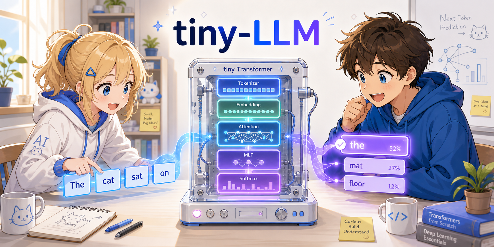

[English](README.md) | **日本語**

<p>
  
</p>

# tiny-LLM from scratch

GPT のような大規模言語モデル（LLM）の核心となるアルゴリズム —— Self-Attention、Query/Key/Value、Multi-Head Attention、次トークン予測 —— を、できるだけ簡潔な Python コードで学ぶための、1 ファイル完結の Transformer 実装です。

## このプロジェクトについて

GPT 系の Transformer を必要最低限まで削ぎ落としたものです。モデル本体は 1 ファイル（`tiny_llm.py`、実行コード約 140 行。第5章で扱う instruction tuning は `tiny_llm_instruct.py` の追加 +約 100 行）に収まり、おもちゃのコーパスで数秒で学習できます。順伝播は手書きで、逆伝播のみ PyTorch の autograd に任せています。

```
"the cat sat on" → Transformer → "the" （次の単語を予測）
```

## 学べること

- **Embedding**: 単語をベクトルに変換する仕組み
- **Positional Embedding（学習型）**: 位置情報の埋め込み
- **Self-Attention（Q, K, V）**: トークン同士が注意を向け合う仕組み
- **Multi-Head Attention**: 複数の注意パターンを並列に走らせる仕組み
- **Causal Masking**: 学習時に未来のトークンを隠す仕組み
- **Feed-Forward Network**: 各トークンを個別に変換する仕組み
- **Residual Connection と Layer Norm**: 深いネットワークを学習可能にする仕組み
- **Cross-Entropy Loss による学習**: モデルが次の単語の予測を覚える仕組み
- **テキスト生成**: 学習済みモデルが 1 トークンずつテキストを生成する仕組み

## 簡略化している点

学習用ツールであり、製品レベルのモデルではありません。主な簡略化は以下の通りです。

| 項目 | tiny-LLM | 実用 LLM |
|--------|----------|-----------------|
| トークナイザ | 空白分割（単語 = トークン） | BPE / SentencePiece（サブワード） |
| 語彙 | 10 単語 | 5万〜20万以上のトークン |
| パラメータ数 | 約 68,000 | 数十億〜数兆 |
| 訓練データ | 40 単語 | 数兆トークン |
| 生成 | Greedy（argmax） | Temperature、top-k、top-p によるサンプリング |
| Dropout / 正則化 | なし | Dropout、weight decay など |
| **コアアルゴリズム** | **同じ** | **同じ** |

## それでも役に立つ理由

これだけ簡略化しても、ここで実装したコアアルゴリズムは、GPT や LLaMA など最先端モデルでもそのまま使われています。違いはスケールが中心で、土台となる構造は共有しています。このコードを理解すれば、Q/K/V の射影、Scaled Dot-Product Attention、Causal Mask、Residual Connection、Layer Normalization、自己回帰的な生成 —— これらすべてが実用 Transformer 実装にそのまま通用するため、現実のコードを読む土台になります。

## クイックスタート

```bash
uv run --with torch tiny_llm.py
```

uv が未インストールの場合は [Tutorial Step 1](docs/ja/tutorial/01_setup.md) のインストール手順を参照してください。

スクリプトを実行すると、学習の進捗と生成結果が表示されます（数値は実行ごとに多少変わります）。

```
epoch   20  loss=1.9469
epoch   40  loss=1.5257
...
epoch  200  loss=0.1147

prompt: "the cat sat on"
output: the cat sat on the mat . the dog sat on the log .
        the cat saw the dog . the dog saw the
```

## ドキュメント

| ドキュメント | 内容 |
|---|---|
| [第1章: データの準備](docs/ja/01_data.md) | 語彙構築、トークン化、訓練データの作り方 |
| [第2章: Transformer](docs/ja/02_transformer.md) | Embedding、Self-Attention、FFN、Forward Pass の全て |
| [第3章: 訓練](docs/ja/03_training.md) | Cross-Entropy Loss、誤差逆伝播、パラメータ更新 |
| [第3章 補足: 勾配の数学](docs/ja/03a_gradient.md) | 微分・偏微分・連鎖律を具体的な数値で解説 |
| [第4章: テキスト生成](docs/ja/04_generation.md) | 次の単語の予測、Greedy Decoding、実際の LLM との比較 |
| [第5章: インストラクションチューニング](docs/ja/05_instruction_tuning.md) | Alpaca 形式、Response マスキング、指示に従う LLM の作り方 |

### チュートリアル

| チュートリアル | 内容 | 所要時間 |
|---|---|---|
| [Step 1: セットアップと実行](docs/ja/tutorial/01_setup.md) | 環境構築、コードの実行、出力の確認 | 5分 |
| [Step 2: データを観察する](docs/ja/tutorial/02_explore_data.md) | トークン化・訓練データの中身を自分の目で確認 | 10分 |
| [Step 3: Transformer の中を覗く](docs/ja/tutorial/03_explore_model.md) | Attention の重み、埋め込みベクトルを可視化 | 15分 |
| [Step 4: 改造してみる](docs/ja/tutorial/04_experiments.md) | パラメータを変えたり、コーパスを変えて実験 | 15分 |
| [Step 5: インストラクションチューニングを試す](docs/ja/tutorial/05_instruction.md) | Alpaca 形式の Instruction Tuning を 3 段階で動かし、丸暗記の限界も体感 | 15分 |

## クレジット

- 企画: t-ishii66
- アーキテクチャ設計: t-ishii66
- プログラミング: Claude Opus 4.7, t-ishii66
- ドキュメント: Claude Opus 4.7, GPT 5.3 Codex, t-ishii66
- レビュー: t-ishii66
- 英訳: Claude Opus 4.7, GPT 5.3 Codex

Copyright(C) 2026 t-ishii66. All rights reserved.
