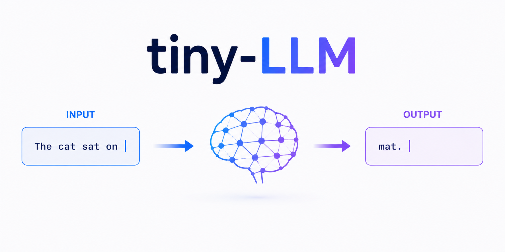

**English** | [日本語](README-jp.md)

<p>
  
</p>

# tiny-LLM from scratch

A single-file Transformer implementation designed to teach the core algorithms behind large language models — self-attention, Query/Key/Value, multi-head attention, and next-token prediction — in the most concise Python code possible.

## What This Is

This project strips a GPT-style Transformer down to its bare essentials. The entire model fits in one file (`tiny_llm.py`, ~140 lines of executable code) and trains in seconds on a toy corpus. The forward pass is written by hand; only backpropagation is delegated to PyTorch's autograd.

```
"the cat sat on" → Transformer → "the" (predicted next word)
```

## What You'll Learn

- **Embedding**: how words become vectors
- **Positional Embedding (learned)**: how position information is injected
- **Self-Attention (Q, K, V)**: how tokens attend to each other
- **Multi-Head Attention**: how multiple attention patterns work in parallel
- **Causal Masking**: how future tokens are hidden during training
- **Feed-Forward Network**: how each token is individually transformed
- **Residual Connections & Layer Norm**: how deep networks stay trainable
- **Training with Cross-Entropy Loss**: how the model learns to predict the next word
- **Text Generation**: how trained models produce text one token at a time

## Simplifications

This is a learning tool, not a production model. Key simplifications include:

| Aspect | tiny-LLM | Production LLMs |
|--------|----------|-----------------|
| Tokenizer | Whitespace split (word = token) | BPE / SentencePiece (subword) |
| Vocabulary | 10 words | 50,000–200,000+ tokens |
| Parameters | ~68,000 | Billions to trillions |
| Training data | 40 words | Trillions of tokens |
| Generation | Greedy (argmax) | Sampling with temperature, top-k, top-p |
| Dropout / regularization | None | Dropout, weight decay, etc. |
| **Core algorithm** | **Same** | **Same** |

## Why It's Still Useful

Despite these simplifications, the core algorithms are **identical** to those used in GPT, LLaMA, and other state-of-the-art models. The difference is scale, not structure. Understanding this code gives you a solid foundation for reading real-world Transformer implementations, because every concept here — Q/K/V projections, scaled dot-product attention, causal masks, residual connections, layer normalization, and autoregressive generation — carries over directly.

## Quick Start

```bash
uv run --with torch tiny_llm.py
```

If you don't have uv installed yet, see the install steps in [Tutorial Step 1](docs/en/tutorial/01_setup.md).

Running the script displays the training progress and generation results (exact numbers may vary between runs):

```
epoch   20  loss=1.9469
epoch   40  loss=1.5257
...
epoch  200  loss=0.1147

prompt: "the cat sat on"
output: the cat sat on the mat . the dog sat on the log .
        the cat saw the dog . the dog saw the
```

## Documentation

1. **[Data Preparation](docs/en/01_data.md)** — Vocabulary, tokenization, and training data construction
2. **[Transformer](docs/en/02_transformer.md)** — Embedding, self-attention, FFN, and the full forward pass
3. **[Training](docs/en/03_training.md)** — Loss function, backpropagation, and parameter updates
   - **[Gradient Math Supplement](docs/en/03a_gradient.md)** — Derivatives, partial derivatives, and chain rule with concrete examples
4. **[Generation](docs/en/04_generation.md)** — Next-word prediction and the path to real LLMs
5. **[Instruction Tuning](docs/en/05_instruction_tuning.md)** — Alpaca format, response masking, and building an instruction-following LLM

### Tutorial

Start here if you're new. Run the code yourself and build your understanding of the Transformer step by step.

| Tutorial | Content | Time |
|---|---|---|
| [Step 1: Setup and Run](docs/en/tutorial/01_setup.md) | Environment setup, running the code, checking the output | 5 min |
| [Step 2: Exploring the Data](docs/en/tutorial/02_explore_data.md) | Examine tokenization and training data with your own eyes | 10 min |
| [Step 3: Peeking Inside the Transformer](docs/en/tutorial/03_explore_model.md) | Visualize attention weights and embedding vectors | 15 min |
| [Step 4: Experiments and Modifications](docs/en/tutorial/04_experiments.md) | Change parameters, modify the corpus, and experiment | 15 min |
| [Step 5: Try Instruction Tuning](docs/en/tutorial/05_instruction.md) | Run the 3-stage Alpaca-style instruction tuning pipeline and see the limits of memorization | 15 min |

## Credits

- Project Planning: t-ishii66
- Architecture Design: t-ishii66
- Programming: Claude Opus 4.6, t-ishii66
- Document: Claude Opus 4.6, GPT 5.3 Codex, t-ishii66
- Review: t-ishii66
- English translation: Claude Opus 4.6, GPT 5.3 Codex

Copyright(C) 2026 t-ishii66. All rights reserved.
