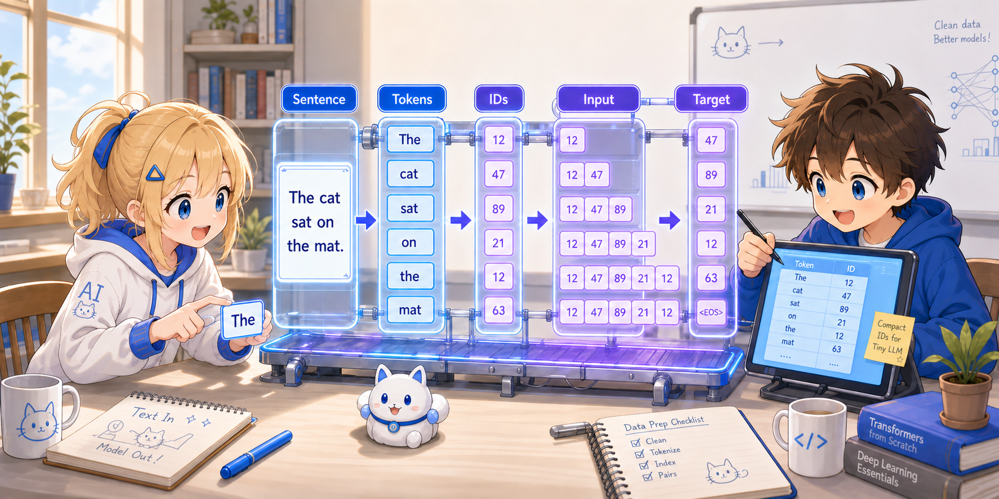
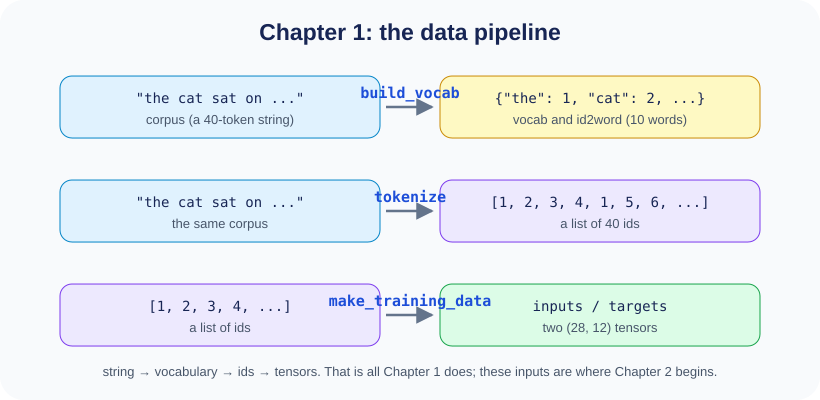

# Chapter 1: Data Preparation — Turning Text into a Form the Model Can Handle



An LLM only ever handles numbers.
Converting "English text" into "a sequence of numbers", and then building "pairs of input and correct answer" —
this chapter follows that entire process with concrete examples.

---

## 1.1 The Corpus (Training Text)

First, we prepare the text that serves as our starting point.

```python
corpus = (
    "the cat sat on the mat . the dog sat on the log . "
    "the cat saw the dog . the dog saw the cat . "
    "the cat sat on the log . the dog sat on the mat ."
)
```

This lump of 40 words (`the` appears 12 times, `cat` 4 times... — repeated words are counted each time)
is the **corpus** — the collection of text data we make the model (the Transformer itself, which
we will assemble in Chapter 2) learn from.
In a practical LLM this refers to a vast, web-scale body of text, but even just 40 words is
enough to learn the structure of a Transformer.

---

## 1.2 `build_vocab` — Assigning a Number to Each Word

```python
def build_vocab(text):
    words = text.split()
    vocab = {"<pad>": 0}
    for w in words:
        if w not in vocab:
            vocab[w] = len(vocab)
    return vocab, {i: w for w, i in vocab.items()}
```

>
> **Python Tips: Dict comprehension `{i: w for w, i in ...}`**
>
> `{i: w for w, i in vocab.items()}` is a **dict comprehension**.
> It is shorthand for building a dictionary with a for loop:
> ```python
> # The following two produce the same result
> id2word = {}
> for w, i in vocab.items():
>     id2word[i] = w
>
> id2word = {i: w for w, i in vocab.items()}  # can be written on one line
> ```
> `vocab.items()` returns pairs like `("the", 1), ("cat", 2), ...`.
> `for w, i in ...` unpacks each pair into `w="the", i=1` and so on.

### What `build_vocab` Does

1. Split the text on whitespace to get a list of words
2. Assign numbers in order of appearance, without duplicates (`<pad>` is a reserved word at number 0)
3. Return a "word → number" dictionary and a "number → word" reverse-lookup dictionary

`<pad>` (padding token) is a filler token used to pad out sequences that are not long enough.
See §1.4 for details.

### Concrete Example

```
args:  "the cat sat on the mat . the dog sat on the log ..."

returns vocab:
  {"<pad>": 0, "the": 1, "cat": 2, "sat": 3, "on": 4,
   "mat": 5, ".": 6, "dog": 7, "log": 8, "saw": 9}

returns id2word:
  {0: "<pad>", 1: "the", 2: "cat", 3: "sat", 4: "on",
   5: "mat", 6: ".", 7: "dog", 8: "log", 9: "saw"}
```

The number of entries in this dictionary is the **vocabulary size (vocab_size)**, which here is **10**.

> **How to read the numbers:** In this project, every major number is designed to be
> a different value. Just by looking at the numbers that appear in a tensor's shape,
> you can immediately tell what they mean:
>
> (A **tensor** is a multi-dimensional array such as `(28, 12, 64)`.
> There is a rigorous mathematical definition, but for reading tiny-LLM
> it is enough to think "tensor = multi-dimensional array". We will come back to this in §1.4.)
>
> | Number | Meaning |
> |------|------|
> | **1** | Number of batches (all 28 samples processed in one batch = full batch) |
> | **2** | Number of Transformer layers (N_LAYERS) |
> | **4** | Number of attention heads (N_HEADS) |
> | **10** | Vocabulary size (vocab_size) * expanded to **15** in Chapter 5 with the added Alpaca markers |
> | **12** | Sequence length (SEQ_LEN) |
> | **16** | Head dimension (head_dim = 64 ÷ 4) |
> | **28** | Number of training samples (corpus 40 tokens − SEQ_LEN 12 = 28, generated by the sliding window in §1.4). This becomes the batch size as-is |
> | **64** | Embedding dimension (D_MODEL) |
> | **128** | FFN hidden layer dimension (D_FF) |
>
> For example, if the shape of variable `x` looks like the following, you can read off its contents from the numbers alone:
>
> ```python
> x.shape  # torch.Size([28, 12, 64])
>          #             │   │   └─ 64: D_MODEL (number of values per token)
>          #             │   └───── 12: SEQ_LEN (number of tokens)
>          #             └───────── 28: number of samples (= batch size)
> ```

> **Difference from real LLMs:** GPT and others use BPE (Byte Pair Encoding) to split words
> further into subwords. Here we simplify to "token = word".

---

## 1.3 `tokenize` — Converting Text into a Sequence of Numbers

```python
def tokenize(text, vocab):
    return [vocab[w] for w in text.split()]
```

>
> **Python Tips: List comprehension `[... for ... in ...]`**
>
> `[vocab[w] for w in text.split()]` is a **list comprehension**.
> It is shorthand for building a list with a for loop:
> ```python
> # The following two produce the same result
> result = []
> for w in text.split():
>     result.append(vocab[w])
>
> result = [vocab[w] for w in text.split()]  # can be written on one line
> ```

### What `tokenize` Does

It splits the text on whitespace and replaces each word with its number from `vocab`.

### Concrete Example

```
args:  text  = "the cat sat on the mat"
       vocab = {"<pad>": 0, "the": 1, "cat": 2, "sat": 3, "on": 4, "mat": 5, ...}

returns: [1, 2, 3, 4, 1, 5]
```

```
"the"  →  1
"cat"  →  2
"sat"  →  3
"on"   →  4
"the"  →  1   ← the same word gets the same number
"mat"  →  5
```

This list of numbers (the **token sequence**) is the basic unit for everything that follows.

---


## 1.4 `make_training_data` — Building Pairs of "Input" and "Correct Answer"

This is the most important part. Training an LLM is essentially the task of **"predicting the next word from the preceding word sequence"**.

```python
def make_training_data(text, vocab):
    tokens = tokenize(text, vocab)
    inputs, targets = [], []
    for i in range(len(tokens) - SEQ_LEN):
        inputs.append(tokens[i : i + SEQ_LEN])
        targets.append(tokens[i + 1 : i + SEQ_LEN + 1])
    return torch.tensor(inputs), torch.tensor(targets)
```

### Why We Slice with `SEQ_LEN` (= the Context Length)

There is an upper limit on how many tokens a Transformer can process in a single computation.
This limit is the **context length (context window)**, and in this project
`SEQ_LEN = 12` corresponds to it.

For example, if we feed the beginning of the corpus as input, it gets cut like this:

```
Fits in one pass (12 tokens):  the cat sat on the mat . the dog sat on the
Doesn't fit:                                                               log . ...
```

You cannot pass 13 or more tokens at once, as in
`the cat sat on the mat . the dog sat on the log .`. Everything from `log` onward is handled by
the next sample, whose window is shifted by one.

That is why, during training, we slice the corpus into "windows of length 12" before handing them to the model.
The same applies at generation time: inside `generate()` we always use only the most recent `SEQ_LEN` tokens as context.
In other words, once the token sequence grows beyond `SEQ_LEN`, the older tokens drop out of the context.

### Relationship to Padding

In large-scale pretraining, the usual practice is not to split text strictly at sentence boundaries,
but to concatenate token sequences and slice them into fixed-length chunks (`SEQ_LEN`) for training.
Because lengths are uniform from the start under this scheme, padding is basically unnecessary.

On the other hand, in training regimes such as SFT, where variable-length samples are packed into the same batch,
short sequences may be filled out with `<pad>` (padding).
Since this code builds training samples at a fixed `SEQ_LEN`,
it effectively uses no padding during training (`<pad>` is defined only as a reserved token).

>
> **Python Tips: Slices `tokens[i : i + SEQ_LEN]`**
>
> A list slice is written `list[start:end]`, and takes elements from start up to **just before** end:
> ```python
> tokens = [1, 2, 3, 4, 5, 6, 7, 8]
> tokens[0:3]   # → [1, 2, 3]      positions 0, 1, 2 (3 is not included)
> tokens[2:5]   # → [3, 4, 5]      positions 2, 3, 4
> tokens[1:4+1] # → [2, 3, 4, 5]   from i+1 up to just before i+SEQ_LEN+1
> ```

>
> **Python Tips: `torch.tensor()` — converting a list into a tensor**
>
> `torch.tensor([[1,2,3], [4,5,6]])` converts a Python list into a PyTorch tensor.
> A tensor is a "multi-dimensional array" that supports GPU computation and automatic differentiation:
> ```python
> import torch
> x = torch.tensor([[1, 2], [3, 4]])
> x.shape  # → torch.Size([2, 2])  ← 2 rows × 2 columns
> ```
>
> Why can't we just leave it as a list? Because libraries for LLMs such as PyTorch are designed
> on the premise that **computation is done in bulk, tensor by tensor**.
> Instead of running the computation for 28 samples × 12 tokens one at a time in a Python for loop,
> you hand over a tensor just once and the optimized C++ / CUDA code inside takes care of it.
> On an NVIDIA GPU this can be executed in parallel across thousands of cores, and simply moving
> the tensor to the GPU makes the same code run on the GPU as-is
> (tiny-LLM is small enough to finish in a few seconds on a CPU, so we don't use a GPU).

### What `make_training_data` Does

1. Convert the entire corpus into a token sequence
2. Starting from the head of that token sequence, slide a window of length `SEQ_LEN` (=12) one token at a time
3. For each window, build a pair of **input** and **correct answer (target)**

### Concrete Example (with SEQ_LEN=12)

The corpus token sequence (all 40 tokens):

```
pos:   0   1   2   3   4   5   6   7   8   9  10  11  12  13 ...
word: the cat sat  on the mat  .  the dog sat  on the log  .  ...
id:    1   2   3   4   1   5   6   1   7   3   4   1   8   6 ...
```

**How the sliding window works:**

```
i=0:
  input  = tokens[ 0:12] = [1,2,3,4,1,5,6,1,7,3,4,1]
  target = tokens[ 1:13] = [2,3,4,1,5,6,1,7,3,4,1,8]
                              ↑ the target is the "next word" for each position of input

i=1:
  input  = tokens[ 1:13] = [2,3,4,1,5,6,1,7,3,4,1,8]
  target = tokens[ 2:14] = [3,4,1,5,6,1,7,3,4,1,8,6]

i=2:
  input  = tokens[ 2:14] = [3,4,1,5,6,1,7,3,4,1,8,6]
  target = tokens[ 3:15] = [4,1,5,6,1,7,3,4,1,8,6,1]

  ... (repeated up to i=27, for 28 samples in total)
```

>
> **About the slide width (stride)**
>
> In this code we slide the window **one word at a time** (i=0, 1, 2, ...).
> But the slide width can in principle be set freely:
>
> ```
> Stride 1:   i=0, 1, 2, 3, ...  → many samples, much overlap
> Stride 4:   i=0, 4, 8, 12, ... → few samples, little overlap
> Stride 12:  i=0, 12, 24, ...   → no overlap (windows are adjacent)
> ```
>
> - **Stride 1** makes maximum use of the data, but most of each pair of adjacent samples
>   overlaps
> - **A large stride** reduces overlap and speeds up computation, but yields fewer samples
> - In large-scale LLM training the corpus is big enough that a large stride
>   causes no problem
>
> In this project the corpus is small, so we use stride 1 to generate the maximum number
> of samples.

### The Target Is the Input Shifted by One

Drawing this as a diagram reveals the essence:

```
input:   the  cat  sat  on   the  mat   .   the  ...
target:  cat  sat  on   the  mat   .   the  dog  ...
         ↑    ↑    ↑    ↑    ↑    ↑    ↑    ↑
         at each position, predict "the word that should come next"
```

At position 0 it's "cat comes after the", at position 1 it's "sat comes after cat"...
The key point is that we **predict the "next word" at every position simultaneously**.

### Shape of the Return Values

```
inputs:  torch.Tensor, shape = (28, 12)    ← 28 samples × 12 tokens
targets: torch.Tensor, shape = (28, 12)    ← the corresponding answers
```

> **Batches and epochs**
>
> This `(28, 12)` is "the form in which all 28 samples (28 rows of 12-word sequences) are gathered into a single lump".
> Let's sort out two terms here.
>
> - **Batch**: the bundle of samples handed to the model (= the Transformer itself) all at once.
>   Here, **this entire lump of 28 rows** is one batch.
>   The code is also written to operate at this unit: rather than looping over the 28 rows one at a time,
>   it runs forward → loss → backward → update once each, on the lump as a whole
> - **Epoch**: one pass through the entire training data.
>   If the training data is divided into 2 batches, one epoch is complete once both batches have been processed.
>   In other words, how many times the parameters are updated during one pass is determined by how many batches you split into
>
> Since this project hands over all 28 samples at once, it is
> **batch size 28 / number of batches 1 / 1 update per epoch**.
> In machine-learning terminology this corresponds to **full-batch gradient descent**
> (`EPOCHS = 200` in Chapter 3 means repeating this one pass 200 times).
>
> With a large corpus, you cannot load all samples into memory at once, so you split them into
> **mini-batches** of several dozen samples each.
> That number of splits becomes the number of updates per epoch, which can reach tens of thousands.
> In every case, the core of learning — "predict the next word" — is the same within each batch.

---

## 1.5 The Flow of Data — The Big Picture



With this, we are ready to hand the data to the model.

In **the next chapter (Chapter 2)**, we will look at how this `inputs` tensor is
processed inside the Transformer.

---

## Summary

| Function | Input | Output | Role |
|------|------|------|------|
| `build_vocab(text)` | string | `vocab` (dict), `id2word` (dict) | Assign a number to each word |
| `tokenize(text, vocab)` | string, vocab | `[int, ...]` (list) | Convert text into a sequence of numbers |
| `make_training_data(text, vocab)` | string, vocab | `inputs` (28,12), `targets` (28,12) | Create training pairs |
