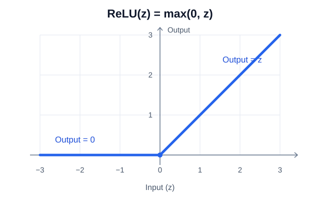
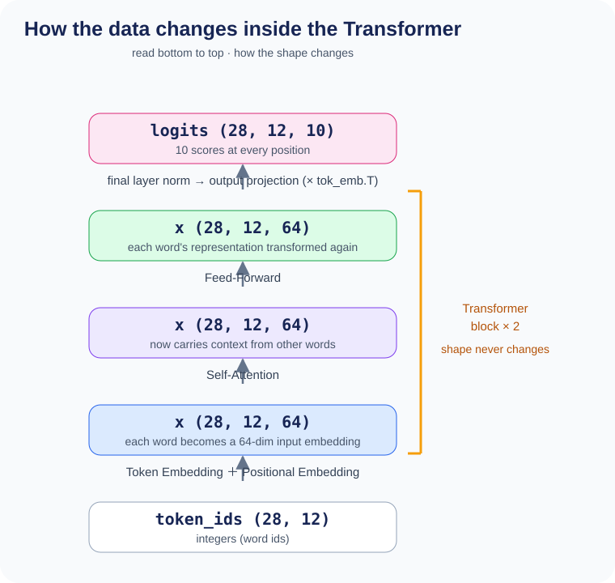

# Chapter 2: Transformer — The Mechanism That Understands Context


In the previous chapter we built the `inputs` tensor (28, 12).
In this chapter we follow how this sequence of numbers is processed inside the Transformer
and ends up as a "prediction of the next word".

To begin with, a **Transformer** is a mechanism for reading text and guessing "the word that comes next".
Having read up to `the cat sat on the`, it answers `mat` — and to do that, it
**compares the words that have appeared so far and measures numerically which of them matters for the next prediction**.
As this comparison is repeated over and over, context seeps into each individual word,
and in the end the model reaches a state where it can predict "the next word".

---

## 2.1 The Overall Flow

```
     scores for 10 words at each position
           ▲
           │  (28, 12, 10)
┌──────────────────────┐
│ Layer Norm           │
│ → Logits (linear)    │  vector → vocabulary scores
└──────────┴───────────┘
           ▲
           │  (28, 12, 64)
┌──────────────────────┐
│ Transformer Block ×2 │  Self-Attention + FFN
└──────────┴───────────┘
           ▲
           │  (28, 12, 64)
┌──────────────────────┐
│ Token Embedding      │  numbers → vectors
│ + Positional Emb.    │  adds position information
└──────────┴───────────┘
           ▲
           │
     token_ids (28, 12)
```

---

## 2.2 Embedding — Turning Numbers into Vectors

### Why Do We Need Vectors?

The word number `3` (= "sat") is just an integer and carries no "meaning".
By converting it into a **64-dimensional vector**, we become able to express
relationships between words numerically.

### The Code

```python
# from TinyTransformer.__init__
self.tok_emb = param(vocab_size, D_MODEL)   # (10, 64)
self.pos_emb = param(SEQ_LEN, D_MODEL)      # (12, 64)
```

```python
# from TinyTransformer.forward
x = self.tok_emb[token_ids] + self.pos_emb[:T]
```

>
> **Python Tips: `param()` — creating values that change during training**
>
> `param()` is a small helper defined in `tiny_llm.py`:
> ```python
> def param(*shape):
>     return nn.Parameter(torch.randn(*shape) * 0.02)
> ```
> - `torch.randn(...)`: fill a tensor of the given shape with random numbers
> - `* 0.02`: keep the values small (large initial values make training unstable)
> - `nn.Parameter(...)`: mark it as "this is **a value that gets updated during training**"
>
> Only tensors carrying this mark get gradients computed by `loss.backward()` and
> get updated by the optimizer (Chapter 3).
> In other words, the moment you write `param(10, 64)`, 640 numbers become learnable.
>
> The initial values are random because, if they were all the same, every dimension
> would behave in exactly the same way and could never learn separate meanings.

>
> **Python Tips: Tensor indexing `tok_emb[token_ids]`**
>
> If you pass a list or tensor of integers to a tensor, you can pull out the rows with those numbers all at once
> (this is called **fancy indexing**):
> ```python
> table = torch.tensor([[0.1, 0.2],    # row 0
>                        [0.3, 0.4],    # row 1
>                        [0.5, 0.6]])   # row 2
>
> table[[2, 0, 1]]
> # → tensor([[0.5, 0.6],   ← row 2
> #            [0.1, 0.2],   ← row 0
> #            [0.3, 0.4]])  ← row 1
> ```
> `tok_emb[token_ids]` retrieves, in one go, the embedding vector corresponding to each token number.

>
> **Python Tips: The slice `pos_emb[:T]`**
>
> `T` is **the number of tokens per sample**
> (in the code it is extracted with `B, T = token_ids.shape`).
> During training it is a full `SEQ_LEN` of 12, but when the context is shorter — for example
> partway through generation — it takes a smaller value.
>
> `[:T]` is a slice that takes "the first T items":
> ```python
> x = torch.tensor([10, 20, 30, 40, 50])
> x[:3]   # → tensor([10, 20, 30])   first 3
> x[:5]   # → tensor([10, 20, 30, 40, 50])   all of them
> ```
> `pos_emb` has 12 rows, but if the input is 4 tokens, `pos_emb[:4]` uses only the first 4 rows.

### Step-by-Step Explanation

**Step 1: Token Embedding**

`tok_emb` is a table of shape `(10, 64)`, where each row is the vector for one word.
The row count of 10 is the vocabulary size itself (10 words including `<pad>`), so
**this single table covers every word**.
Also, the vector pulled out by a word ID (for example `tok_emb[3]` = the vector for "sat")
is called a **token embedding**.

```
tok_emb = [
  row0: [0.01, -0.03, 0.02, ...],   ← the vector for "<pad>" (64 dims)
  row1: [0.05,  0.01, -0.02, ...],  ← the vector for "the"
  row2: [-0.01, 0.04,  0.03, ...],  ← the vector for "cat"
  ...
  row9: [0.02, -0.01,  0.05, ...],  ← the vector for "saw"
]
```

When `token_ids = [1, 2, 3, 4, ...]`, `tok_emb[token_ids]` simply pulls out
row 1, row 2, row 3, row 4, and so on.

```
token_ids:     [1,     2,     3,     4,    ...]
                ↓      ↓      ↓      ↓
from tok_emb:  [the],  [cat], [sat], [on], ...   ← each a 64-dim vector
```

Resulting shape: `(28, 12)` → `(28, 12, 64)`

**Step 2: Positional Embedding**

Even the same word "the" plays a different role at the start of a sentence than in the middle.
`pos_emb` is a table holding per-position information: "position 0 is this vector,
position 1 is this vector, ...".
This "vector corresponding to a position" is called a **positional embedding**.

```
pos_emb = [
  pos0: [0.02, -0.01, 0.01, ...],   ← 64 dims
  pos1: [0.01,  0.03, -0.02, ...],
  pos2: [-0.03, 0.02,  0.01, ...],
  ...
  pos11: [0.01, 0.01, -0.04, ...],
]
```

We simply add these together:

```
x = tok_emb[token_ids] + pos_emb[:T]

position 0: token embedding of "the" + positional embedding of position 0 = the input embedding of "the at position 0"
position 1: token embedding of "cat" + positional embedding of position 1 = the input embedding of "cat at position 1"
...
```

The `x` obtained from this addition is called the **input embeddings**.
This `x` is the first representation handed to the next Self-Attention block.

> **Key point:** Both `tok_emb` and `pos_emb` are **learnable parameters**.
> They start out random, but are updated into meaningful values through training.
>
> **About the count:** In this project, there is **exactly one each** of `tok_emb`
> and `pos_emb` for the whole model.

---

## 2.3 How Self-Attention Works — The Core of the Transformer

Self-Attention computes "which word in a sentence should pay attention to which word".
This is the single most important mechanism in the Transformer.

Three elements appear in this section.
For now it is enough to keep just their names and roles in mind.

- **Query / Key / Value (Q, K, V)**: splitting each word into three guises — "the searching side",
  "the searched side", and "the information to hand over". This is the central idea of Self-Attention
- **Attention score**: a number expressing how much each word attends to each other word
- **Multi-Head Attention**: a mechanism that splits the computation of a single Attention score into several and runs them in parallel.

### Let's Be Honest Up Front

When learning Self-Attention for the first time, many people end up wondering
**"why on earth do we do this?"**.
The reason for splitting into Query, Key, and Value, the reason for scoring with a dot product,
the reason for dividing by $\sqrt{d_k}$ — for each of them, "why do it that way" is hard to grasp intuitively.

In fact, the Q/K/V mechanism has **both a theoretical background and empirical refinements**.

**Things with a theoretical basis:**
- **Separating Q/K/V**: based on ideas from information retrieval (IR).
  In a search engine, the "search query (Q)" and the "document title (K)" are different things,
  and what you retrieve is the "body of the matched document (V)".
  Even for the same word, the "searching side" and the "searched side" need different representations
  — so handling them separately is a reasonable design
- **Dividing by $\sqrt{d_k}$**: an adjustment to keep the computed values from growing too large.
  This one can be derived properly from statistics (details below)

**Things that simply worked out empirically:**
- **The Attention mechanism itself** (proposed in the 2017 paper "Attention Is All You Need")
- **Multi-Head Attention**

Rather than being derived from theory, both are of the "we tried it and it worked" variety.
We will look at the structure in detail from here on.

### The Starting Point — One Set of 12 Words of Input Embeddings

Up to the previous section, we reached the point where each word has a 64-dimensional **input embedding**.
The overall shape is `(28, 12, 64)`.

From here, we focus on **just one of the 28 sets**.
The 28 only means "the same computation is being done for 28 sets at once",
so you are free to forget about it while understanding the mechanism.

Then the object of our thinking becomes much simpler.
Taking the first set (sliding window i=0 from Chapter 1) as an example, it is the following 12 words.

```
1 set = 12 words
  the  cat  sat  on  the  mat  .  the  dog  sat  on  the

Each word has a 64-dimensional input embedding:
  "the" → [ 0.05,  0.01, -0.02, ... ]   ← 64-dimensional input embedding
  "cat" → [-0.01,  0.04,  0.03, ... ]
  "sat" → [ 0.02, -0.03,  0.01, ... ]
  ... (for all 12 words)
```

From this **64-dimensional vector for a single word**, we build three vectors: Q, K, and V —
this is where Self-Attention begins.

### Query, Key, Value — Three Roles

In Self-Attention, each word has three faces:

| Role | Meaning | Analogy |
|------|------|--------|
| **Query (Q)** | "what am I looking for?" | the person asking |
| **Key (K)** | "what kind of information do I hold?" | a name tag / label |
| **Value (V)** | "the actual information I hold" | the content of the answer |

**Using a search analogy:**
- Q is the "search term"
- K is "the title of each page"
- V is "the body text of each page"

The higher the match between Q and K (the dot product), the more of that V gets taken in.

### How Q, K, and V Are Born from x

We said "Q, K, and V are separate things", but the raw material is **only a single x**.
All three are built from that x. This is the first point where people get confused.

`x` is the input embedding of each word that we saw at the starting point.
To make them easier to refer to from here on, let's give each word a name.

```
"the" → x₀ = [0.05, 0.01, -0.02, ...]   ← 64-dimensional vector
"cat" → x₁ = [-0.01, 0.04, 0.03, ...]   ← 64-dimensional vector
"sat" → x₂ = [0.02, -0.03, 0.01, ...]   ← 64-dimensional vector
```

We multiply this **same x** by **three different weight matrices** to build Q, K, and V.
Written as a formula, that's all there is to it:

$$Q = x \cdot W_q, \quad K = x \cdot W_k, \quad V = x \cdot W_v$$

Let's look at it concretely with "sat" ($x_2$) as the example:

```
x₂ (the vector for "sat")    ← 64 dims
    │
    ├── × Wq (64×64 matrix) ──→ Q₂ = [0.12, -0.08, ...]  ← 64 dims "what am I looking for?"
    │
    ├── × Wk (64×64 matrix) ──→ K₂ = [-0.05, 0.15, ...]  ← 64 dims "what do I hold?"
    │
    └── × Wv (64×64 matrix) ──→ V₂ = [0.07, 0.03, ...]   ← 64 dims "information to hand over"
```

`Wq` / `Wk` / `Wv` are each 64×64 weight matrices.
The important thing here is that these are not fixed rules decided by a human, but **learned parameters**.
Their initial values are random, but as training progresses,
"what kind of searching representation is effective" and "what kind of holding representation is effective" take shape.

Looking at the shapes: $x$ is (12, 64) and $W_q$ is (64, 64), so $Q$ is also (12, 64).
The shape doesn't change — the contents get converted into "for asking", "for being searched", and "for information" respectively.

**Multiplying by a weight matrix to convert into a different representation** like this is called **projection**.

In fact there is one more weight matrix, **$W_o$** (64×64).
It is not used in computing Q/K/V, but to **integrate the final output** of Attention.
Its role is to merge the results that were split across Multi-Heads back into one, and it appears in Step 7.

To summarize, Self-Attention has **four weight matrices**:

| Matrix | Shape | Role | When it's used |
|------|------|------|----------------|
| $W_q$ | (64, 64) | convert x → Query | at the start (Step 1) |
| $W_k$ | (64, 64) | convert x → Key | at the start (Step 1) |
| $W_v$ | (64, 64) | convert x → Value | at the start (Step 1) |
| $W_o$ | (64, 64) | output projection after merging heads | at the end (Step 7) |

### Attention Scores — Computing "Whom to Attend To"

Once Q and K are ready, we measure their "degree of match" with a dot product:

$$\text{score}(i, j) = \frac{Q_i \cdot K_j^T}{\sqrt{d_k}}$$

A single element of the **score matrix (scores)** is born from the dot product of the two vectors $Q_i$ and $K_j$
(**16-dimensional** after the Multi-Head split, or 64-dimensional before it).
Since $Q_i$ is the Query of each word, there are **12 of them** ($Q_0$ through $Q_{11}$),
and likewise there are **12** $K_j$ ($K_0$ through $K_{11}$).
Taking the dot product over all combinations (12 × 12 = 144 of them) gives a **12×12 score matrix (scores)**.

Let's first compute just one pair. Take $i = 2$ ("sat") and $j = 1$ ("cat"),
that is, $\text{score}(2, 1)$. We start from the numerator, $Q_2 \cdot K_1$:

```
Q₂ = [0.12, -0.08, 0.05, 0.21, ...]   ← the Query vector of "sat"
K₁ = [0.09,  0.15, 0.03, 0.18, ...]   ← the Key vector of "cat"

dot product = 0.12×0.09 + (-0.08)×0.15 + 0.05×0.03 + 0.21×0.18 + ... (sum of the products over each dimension)
            = 2.1 (a single scalar value)
```

Doing this computation for all (i, j) combinations produces the 12×12 score matrix.
Looking at the row for "sat" (i=2):

```
Take the dot product of "sat"'s Q₂ with the K of each word:

  Q₂("sat") · K₀("the") = 0.3   ← not very related
  Q₂("sat") · K₁("cat") = 2.1   ← a strong match! ("who sat?" → "cat!")
  Q₂("sat") · K₂("sat") = 0.8   ← moderately related to itself too
```

We divide by $\sqrt{d_k}$ to prevent the dot products from becoming too large when the dimensionality is high,
which would make softmax produce an extreme distribution (almost only 0s and 1s).
This is a normalization that can be derived statistically.

Laying out all 144 of them gives a 12×12 matrix like the following
(for space reasons only the top-left 3×3 is shown).

$$
\text{scores} = \frac{1}{\sqrt{d_k}}
\begin{pmatrix}
Q_0 \cdot K_0 & Q_0 \cdot K_1 & Q_0 \cdot K_2 & \cdots \\
Q_1 \cdot K_0 & Q_1 \cdot K_1 & Q_1 \cdot K_2 & \cdots \\
Q_2 \cdot K_0 & Q_2 \cdot K_1 & Q_2 \cdot K_2 & \cdots \\
\vdots & \vdots & \vdots & \ddots
\end{pmatrix}
$$

Here each vector corresponds to one of the 12 words in one set:

$$Q_0 = Q_0(\text{"the"}), \quad Q_1 = Q_1(\text{"cat"}), \quad Q_2 = Q_2(\text{"sat"}), \quad \dots$$

$$K_0 = K_0(\text{"the"}), \quad K_1 = K_1(\text{"cat"}), \quad K_2 = K_2(\text{"sat"}), \quad \dots$$

Putting numbers into each element gives this (the third row is the "sat" row we just saw).

$$
\text{scores} = \frac{1}{\sqrt{d_k}}
\begin{pmatrix}
1.4 & 0.5 & 0.3 & \cdots \\
0.6 & 1.6 & 0.4 & \cdots \\
0.3 & 2.1 & 0.8 & \cdots \\
\vdots & \vdots & \vdots & \ddots
\end{pmatrix}
$$

Row $i$ represents "whom the $i$-th word is looking at",
and column $j$ represents "by whom the $j$-th word is being looked at".

### Softmax — Converting Scores into Probabilities

Just for this part we step a little away from the Transformer and talk pure mathematics.
Softmax is a function that converts an arbitrary sequence of numbers into "a probability distribution summing to 1.0":

$$\text{softmax}(z_i) = \frac{e^{z_i}}{\sum_j e^{z_j}}$$

$e$ is Napier's constant (≈ 2.718). We make each element positive with $e^{z_i}$, then
divide by the total to turn them into probabilities. The larger the score, the larger the probability.

$z$ is the sequence of numbers given as input, that is, the scores.
Let's compute concretely with the "sat" row above (its first 3 elements).

$$z = (\,0.3,\; 2.1,\; 0.8\,)$$

First we turn each element into $e^{z_i}$ so that all values are positive:

$$e^{z} = (\,e^{0.3},\; e^{2.1},\; e^{0.8}\,) = (\,1.35,\; 8.17,\; 2.23\,)$$

Next we take their sum:

$$\sum_j e^{z_j} = 1.35 + 8.17 + 2.23 = 11.75$$

Finally, dividing each element by this sum gives the probabilities:

$$\text{softmax}(z) = \left(\, \frac{1.35}{11.75},\; \frac{8.17}{11.75},\; \frac{2.23}{11.75} \,\right) = (\,0.11,\; 0.70,\; 0.19\,)$$

The total is $0.11 + 0.70 + 0.19 = 1.0$.
"cat" (2.1), which had the highest score, gets the highest attention weight, 0.70.

Written as a formula:

$$\text{attn}(i, j) = \text{softmax}_j(\text{score}(i, j))$$

Laying out these `attn(i, j)` values gives the **Attention weight matrix (attn_weights)**,
whose size is **sequence length × sequence length** (12 × 12).
In other words, the size is the number of words in the sentence being processed × the number of words:

```
         j=0    j=1    j=2    j=3          j=11
        "the"  "cat"  "sat"  "on"   ...   "the"
i=0 "the" [ 1.00   0      0      0    ...   0    ]
i=1 "cat" [ 0.35   0.65   0      0    ...   0    ]
i=2 "sat" [ 0.11   0.70   0.19   0    ...   0    ]  ← same values as the softmax example above
i=3 "on"  [ 0.05   0.10   0.60   0.25 ...   0    ]
 :                    :
i=11"the" [ 0.02   0.03   0.05   0.04 ...   0.12 ]
```

Each row is the attention pattern of one token (i), and each row sums to 1.0.

The upper right is 0 because we apply a **causal mask**.

Let's think from the standpoint of "sat" (i=2).
The only things "sat" can measure a relationship with are `the` and `cat`, which appeared before it, plus itself, `sat`.
The `on` and `the` that come after it do not yet exist in an actual text-generation setting.
Being able to compute a relationship with words that haven't appeared yet doesn't make sense.

What's more, the purpose of this model is "to guess the next word".
Predicting `on` while already knowing that `on` follows `sat` is just peeking at the answer,
not learning. So we set the attention weights for the future part to 0 in advance.

Expressing "may look / may not look" as a matrix gives a form where only the lower triangle is permitted.

$$
\text{mask} =
\begin{pmatrix}
1 & 0 & 0 & 0 & \cdots \\
1 & 1 & 0 & 0 & \cdots \\
1 & 1 & 1 & 0 & \cdots \\
1 & 1 & 1 & 1 & \cdots \\
\vdots & \vdots & \vdots & \vdots & \ddots
\end{pmatrix}
$$

1 means "may look", 0 means "may not look (the future)".
In row $i$, every column that comes after itself is set to 0.
The upper right of the Attention weight matrix above is 0 because this shape is overlaid on it.

For example, the row i=0 ("the") looks only at itself (1.0),
while the row i=2 ("sat") distributes its attention over only the 3 words up to itself.
We will see the implementation in Step 4 of §2.4.

### The Output — A Weighted Sum of Values

So far we have obtained "whom to attend to and how much" (the attention weights).
This is the $\text{attn}(i, j)$ computed in the previous section — the attention that the $i$-th word
directs at the $j$-th word, which for the "sat" row was $(0.11,\; 0.70,\; 0.19,\; 0,\; \dots)$.
What remains is the process of using this $\text{attn}(i, j)$ to build the final output.

What we use for that is $V_j$. Since it only appeared briefly a while ago, let's review it.
$V_j$ is the **Value** of the $j$-th word, that is, "the information that word hands over to others",
created by $x_j \cdot W_v$. Since $W_v$ is a learned parameter,
**what is effective to hand over** gets decided through training.
The values start out random, but as training progresses,
information such as "a creature that can be a subject" accumulates in the Value of `cat`.

Using the attention weights as coefficients, we mix these Values together:

$$\text{out}_i = \sum_j \text{attn}(i, j) \cdot V_j$$

For "sat", using the attention weights $(0.11,\; 0.70,\; 0.19)$ we just obtained:

```
output for "sat" = 0.11 × V₀("the") + 0.70 × V₁("cat") + 0.19 × V₂("sat")
```

We get a new vector for "sat" into which the information of "cat" is mixed the most.
The original $x_2$ was a representation of the word "sat" itself, but
the vector obtained here represents **"sat in the context of a cat having sat"**.

This $\text{out}_i$ is called the **context vector** for that position.
**This is precisely what Self-Attention was after.**
Q, K, V, the scores, the Softmax — all of them were tooling to build this single vector,
a word representation that has absorbed context.

One context vector is a 64-dimensional vector.
Since the same computation is done at all 12 positions, one set yields
12 context vectors of 64 dimensions each.

Now recall that `the` appears 4 times in this one set
(positions 0, 4, 7, 11). At the input stage, the token embeddings of those 4 `the`s
came from the same row of `tok_emb`, so they were **completely identical**.
Yet all 4 context vectors end up with different values.
The `the` at position 0 can only see itself, while the `the` at position 11 sees all 11 preceding words,
so the distributions of what they attend to differ.

**The same word becomes a different representation depending on the context it sits in** —
this is what "understanding context" actually consists of.

---


## 2.4 Implementing Self-Attention — Reading the `self_attention` Function

From here we follow how the mechanism seen in §2.3 is actually written in code.
Since it centers on tensor shape manipulation, if your only goal is to understand the mechanism
you may skip this section and go straight to §2.5.

In §2.3 we followed the mechanism focusing on only one set (12 words).
The actual code, however, **processes 1 batch = 28 sets simultaneously**.
Because the computation for 28 sets is done in one go, the shapes that appear from here on
have a 28 attached at the front. What is being done is the same as in §2.3,
just lined up 28 sets' worth.

```python
def self_attention(x, Wq, Wk, Wv, Wo):
    B, T, D = x.shape        # B=28, T=12, D=64
    head_dim = D // N_HEADS   # 64 // 4 = 16
```

The `B`, `T`, and `D` at the top are respectively the **number of sets, 28**, the **number of words per set, 12**,
and the **number of dimensions per word, 64**.

**Step 1: Compute Q, K, V**

```python
    Q = x @ Wq   # (28, 12, 64) @ (64, 64) → (28, 12, 64)
    K = x @ Wk   # same as above
    V = x @ Wv   # same as above
```

>
> **Python Tips: The `@` operator (matrix multiplication)**
>
> Python's `@` is the operator for **matrix multiplication**.
> It corresponds to $A \times B$ in mathematics:
> ```python
> import torch
> A = torch.tensor([[1, 2],
>                    [3, 4]])       # (2, 2)
> B = torch.tensor([[5, 6],
>                    [7, 8]])       # (2, 2)
> A @ B
> # → tensor([[19, 22],             1×5+2×7=19, 1×6+2×8=22
> #            [43, 50]])            3×5+4×7=43, 3×6+4×8=50
> ```
> `x @ Wq` is "each word vector (64 dims) × weight matrix (64×64)",
> converting each word into a different 64-dimensional space.

We multiply each word's 64-dimensional vector by a weight matrix to obtain Query, Key, and Value.

**Step 2: Split into Multi-Head**

```python
    Q = Q.view(B, T, N_HEADS, head_dim).transpose(1, 2)
    # (28, 12, 64) → (28, 12, 4, 16) → (28, 4, 12, 16)
```

>
> **Python Tips: `.view()` and `.transpose()` — changing a tensor's shape**
>
> **`.view()`** changes a tensor's shape. The data itself does not change:
> ```python
> x = torch.tensor([1, 2, 3, 4, 5, 6])   # shape: (6,)
> x.view(2, 3)    # → tensor([[1, 2, 3],
>                 #            [4, 5, 6]])   shape: (2, 3)
> x.view(3, 2)    # → tensor([[1, 2],
>                 #            [3, 4],
>                 #            [5, 6]])       shape: (3, 2)
> ```
> Here we change `(28, 12, 64)` into `(28, 12, 4, 16)`.
> Since 64 = 4×16, we decompose the last 64 dimensions into "4 heads × 16 dimensions".
>
> **`.transpose(1, 2)`** swaps the two specified axes:
> ```python
> x = torch.zeros(28, 12, 4, 16)
> x.transpose(1, 2).shape   # → (28, 4, 12, 16)
>                            #         ↑  ↑
>                            #    axis 1 and axis 2 swapped
> ```
> This brings the "head" axis to the front, so that each head can compute attention independently.

What we split here is the last dimension (64 dims) of the `Q`, `K`, `V` created in Step 1.
That is, we split "one 64-dimensional representation" into smaller `4 heads × 16 dimensions` representations.

We split the 64 dimensions into 4 heads × 16 dimensions.

**Why split at all?**

A single Attention head can only produce **one softmax distribution** per token.
In other words, it can express only one attention pattern.

But "sat" surely wants to attend to multiple partners at once:

```
What "sat" wants to know:
  - "Who sat?" → wants to attend to "cat"
  - "Where did it sit?" → wants to attend to "mat"
```

Trying to express both of these with a single softmax ends in a half-hearted compromise.
With Multi-Head, you can have **a different attention pattern per head**:

```
Head 0: "sat" → attends strongly to "cat" (subject-verb relation)
Head 1: "sat" → attends strongly to "mat" (verb-place relation)
Head 2: "sat" → attends strongly to "on" (adjacent word)
Head 3: "sat" → attends to "." (sentence boundary)
```

Each head computes Attention in a small 16-dimensional space.
Four heads of 16 dimensions can capture a wider variety of relationships simultaneously
than one head of 64 dimensions — this is the essence of Multi-Head.

(What each head actually learns depends on the training data.)

**Step 3: Computing the Attention scores**

```python
    scores = (Q @ K.transpose(-2, -1)) / math.sqrt(head_dim)
    # (28, 4, 12, 16) @ (28, 4, 16, 12) → (28, 4, 12, 12)
```

>
> **Python Tips: `.transpose(-2, -1)` — specifying axes with negative indices**
>
> In Python, a negative number means "count from the back".
> For a 4-dimensional tensor `(28, 4, 12, 16)`:
> ```
> axis:     0    1    2    3
>          28    4   12   16
>
> negative: -4   -3   -2   -1
> ```
> So `-2` is "second from the back" = axis 2 (size 12),
> and `-1` is "the last" = axis 3 (size 16).
>
> `.transpose(-2, -1)` **swaps the last two axes**, so:
> ```python
> K.shape                     # (28, 4, 12, 16)
> K.transpose(-2, -1).shape   # (28, 4, 16, 12)
>                              #           ↑   ↑
>                              #       12 and 16 got swapped
> ```
> Why use negative numbers? Because writing "the last two" always works correctly
> even if the total number of axes changes.
> `transpose(2, 3)` gives the same result, but `(-2, -1)` is more general.

`scores[b][h][i][j]` = in the **b-th set** (out of all 28 sets), in **head h**,
how much word i attends to word j.

A concrete computation (one head, a picture of the first 3 words).
This is the same part as the top left of the score matrix seen in §2.3:

```
         K₀     K₁     K₂         ← Key (labels on the information)
Q₀  [  1.4    0.5    0.3 ]
Q₁  [  0.6    1.6    0.4 ]
Q₂  [  0.3    2.1    0.8 ]   ← "sat" attends strongly to "cat" (who sat?)
```

At this point these are still raw scores, so the rows do not sum to 1.0.
Converting them into probabilities is the softmax in Step 5; hiding the future is the next Step 4.

**Step 4: Causal Mask**

```python
    mask = torch.triu(torch.ones(T, T), diagonal=1).bool()
    scores = scores.masked_fill(mask, float("-inf"))
```

>
> **Python Tips: `torch.triu()` and `float("-inf")`**
>
> **`torch.triu()`** creates an upper triangular matrix.
> With `diagonal=1` it starts one above the diagonal:
> ```python
> torch.triu(torch.ones(3, 3), diagonal=1)
> # → tensor([[0, 1, 1],
> #            [0, 0, 1],
> #            [0, 0, 0]])
> ```
>
> **`float("-inf")`** is Python's "negative infinity".
> It's a special value smaller than any number, and passing it through softmax gives probability 0:
> ```python
> float("-inf") < -9999999   # → True
> ```
>
> **`.masked_fill(mask, value)`** fills the positions where mask is True with value.

In a language model there is a constraint that "you must not look at future words".
The token at position i can see only the tokens at positions 0 through i.

```
Before mask:         After mask (hide the future with -inf):
     0    1    2         0     1      2
0 [ 0.8  0.1  0.1]   [ 0.8  -inf   -inf]
1 [ 0.3  0.5  0.2]   [ 0.3   0.5   -inf]
2 [ 0.2  0.6  0.2]   [ 0.2   0.6    0.2]
```

Since `-inf` becomes 0 under softmax, information from future tokens is completely cut off.

**Step 5: Softmax**

```python
    attn_weights = F.softmax(scores, dim=-1)
```

>
> **Python Tips: `dim=-1` — "the last axis"**
>
> Many PyTorch functions take a `dim` argument specifying "along which axis to process".
> `dim=-1` means **the last axis** (i.e. the direction along each row):
> ```python
> x = torch.tensor([[1.0, 2.0, 3.0],
>                    [1.0, 1.0, 1.0]])
>
> F.softmax(x, dim=-1)   # softmax within each row
> # → tensor([[0.09, 0.24, 0.67],   ← each row sums to 1.0
> #            [0.33, 0.33, 0.33]])
>
> x.mean(dim=-1)          # mean of each row
> # → tensor([2.0, 1.0])
> ```
> `dim=0` means the column direction, `dim=1` the row direction, and `dim=-1` is always the last axis.

We convert each row into a probability distribution (sum = 1.0):

```
After softmax:
     0     1     2
0 [ 1.0   0.0   0.0]    ← "the" can see only itself (sum 1.0)
1 [ 0.35  0.65  0.0]    ← "cat" sees "the" and itself (sum 1.0)
2 [ 0.11  0.70  0.19]   ← "sat" can see everyone (sum 1.0)
```

**Step 6: Weighted sum of Values**

```python
    out = attn_weights @ V   # (28, 4, 12, 12) @ (28, 4, 12, 16) → (28, 4, 12, 16)
```

Here we obtain the **context vector `out`** for each position.

> **A note on shapes: think of it with 28 and 4 ignored**
>
> In addition to the leading **28** (the number of sets), the **4** (the number of heads) is also
> just 4 heads independently doing the same computation. You may ignore both.
>
> In other words, the core is the following matrix multiplication:
> ```
> attn_weights (12, 12)  @  V (12, 16)  →  out (12, 16)
> ```

Let's look concretely at what this `attn_weights @ V` is doing.

`attn_weights` is a 12×12 matrix of attention weights, already causally masked.

```
attn_weights (12×12)
           "the"  "cat"  "sat"   …        ← whom to look at (j)
  "the" [  1.0    0      0       … ]
  "cat" [  0.35   0.65   0       … ]
  "sat" [  0.11   0.70   0.19    … ]
    ⋮
```

`V` is a 12×16 matrix, 12 Value vectors (16 dims) of each token lined up.

```
V (12×16)
  V₀("the")  = [ 0.03, -0.01,  0.05, … ]   ← 16 dims
  V₁("cat")  = [ 0.07,  0.12, -0.03, … ]
  V₂("sat")  = [ 0.01,  0.08,  0.04, … ]
    ⋮
  V₁₁("the") = [ … ]
```

By matrix multiplication, the output for the "sat" row (i=2) is:

```
out₂ = 0.11 × V₀("the") + 0.70 × V₁("cat") + 0.19 × V₂("sat") + 0 + 0 + ...
                                                                    ↑ 0 from the causal mask

     = [0.11×0.03 + 0.70×0.07 + 0.19×0.01,      ← 1st element of the 16-dim vector
        0.11×(-0.01) + 0.70×0.12 + 0.19×0.08,    ← 2nd element
        ...]                                       ← ...16 in total
```

→ We obtain a new 16-dimensional vector for "sat", into which the Value of "cat" is mixed the most (×0.70).
This is computed for all tokens simultaneously, and the result is a (12, 16) matrix.

**Step 7: Merging heads and the output projection**

```python
    out = out.transpose(1, 2).contiguous().view(B, T, D)  # → (28, 12, 64)
    out = out @ Wo                                          # output projection
```

Up to this point, for each token, 4 heads have each produced a 16-dimensional result
(4 × 16 = 64). Step 7 is the process of **integrating these into a single 64-dimensional vector**.
First we concatenate the 4 heads' worth back into the original 64 dimensions (7a–7c),
then multiply by `Wo` to mix information across the heads (7d).

The first line chains three operations. Let's follow them one at a time.

**Step 7a: `.transpose(1, 2)` — swapping the head axis and the token axis**

```
Current shape of out: (28, 4, 12, 16)
                       ↑   ↑   ↑   ↑
                    batch head token head_dim

transpose(1, 2) → swap axis 1 (head) and axis 2 (token)

Resulting shape:      (28, 12, 4, 16)
                       ↑   ↑   ↑   ↑
                    batch token head head_dim
```

Thanks to this swap, the "4 heads' worth of results" for each token end up lined up next to each other.

**Step 7b: `.contiguous()` — rearranging memory**

`.transpose()` does not actually move the data; it only changes "the order in which it is read".
But the following `.view()` requires data that is contiguous in memory.
`.contiguous()` actually lays the data out again in the new order.

The shape does not change (still `(28, 12, 4, 16)`). Only the internal arrangement is tidied up.

**Step 7c: `.view(B, T, D)` — concatenating the 4 heads into one**

```
(28, 12, 4, 16) → (28, 12, 64)
             ↑ ↑           ↑
          merged into 4 × 16 = 64
```

For each token, we simply concatenate the 16-dimensional vectors of the 4 heads back into 64 dimensions:

```
For the token "sat":

  Head 0 output: [a₀, a₁, ..., a₁₅]     ← 16 dims (captured the relation to the subject)
  Head 1 output: [b₀, b₁, ..., b₁₅]     ← 16 dims (captured the relation to the place)
  Head 2 output: [c₀, c₁, ..., c₁₅]     ← 16 dims
  Head 3 output: [d₀, d₁, ..., d₁₅]     ← 16 dims

  after view: [a₀, ..., a₁₅, b₀, ..., b₁₅, c₀, ..., c₁₅, d₀, ..., d₁₅]
              └─── 64 dims ──────────────────────────────────────────┘
```

**Step 7d: `@ Wo` — the output projection**

```python
    out = out @ Wo   # (28, 12, 64) @ (64, 64) → (28, 12, 64)
```

Finally we multiply by `Wo` (a 64×64 weight matrix) to mix the information of the 4 heads together.
Merely concatenating leaves the first 16 of the 64 dimensions as Head 0, the next 16 as Head 1, and so on —
the results of each head are just lined up independently, section by section.
Since `Wo` uses all 64 dimensions to build a new 64 dimensions,
"the subject information found by Head 0", "the place information found by Head 1",
"the adjacent-word information found by Head 2", and "the boundary information found by Head 3"
get integrated into a single vector across the section walls.

What it does is the same **projection** as `x @ Wq` and friends (multiplying by a weight matrix to
convert into a different representation; see §2.3). Because it is applied to the **output** of Attention
rather than creating Q/K/V at the entrance, it is called the **output projection**.

---

## 2.5 Layer Normalization — Stabilizing the Values

```python
def layer_norm(x, g, b, eps=1e-5):
    mean = x.mean(dim=-1, keepdim=True)
    var = x.var(dim=-1, keepdim=True, unbiased=False)
    return g * (x - mean) / torch.sqrt(var + eps) + b
```

>
> **Python Tips: `keepdim=True` — keeping the dimension**
>
> `mean(dim=-1)` is the operation of **taking the mean along the last axis**.
> Since the several numbers that were lined up collapse into a single mean value, that axis is
> squashed and the number of dimensions decreases by one.
> If you add `keepdim=True`, it remains as an axis of size 1:
> ```python
> x = torch.tensor([[1.0, 2.0, 3.0],
>                    [4.0, 5.0, 6.0]])   # shape: (2, 3)
>
> x.mean(dim=-1)                # → tensor([2., 5.])        shape: (2,)
>                               #    row 1: (1+2+3)/3 = 2, row 2: (4+5+6)/3 = 5
> x.mean(dim=-1, keepdim=True)  # → tensor([[2.], [5.]])    shape: (2, 1)
> ```
> In `layer_norm` the last axis is 64-dimensional, so
> we get one mean out of 64 numbers (and likewise `var` gives one variance).
> Setting `keepdim=True` makes **broadcasting** (the mechanism that automatically matches shapes)
> work correctly in subtractions such as `x - mean`.

We normalize each vector to "mean 0, variance 1", then apply the scale `g` and shift `b`.

$$\text{LayerNorm}(x) = g \cdot \frac{x - \mu}{\sqrt{\sigma^2 + \epsilon}} + b$$

### Why Is It Needed?

In deep learning, as layers pile up, the values of a vector can become extremely large
(or extremely small). Layer Norm prevents this and stabilizes training.

### Concrete Example

```
input:      [2.0, 4.0, 6.0, 8.0]
mean:       5.0
variance:   5.0
normalized: [-1.34, -0.45, 0.45, 1.34]   ← to mean 0, variance 1
```

---

## 2.6 Feed-Forward Network — Transforming Each Word Individually

```python
def feed_forward(x, W1, b1, W2, b2):
    return F.relu(x @ W1 + b1) @ W2 + b2
```

$$\text{FFN}(x) = \text{ReLU}(x \cdot W_1 + b_1) \cdot W_2 + b_2$$

### What `feed_forward` Does

1. `x @ W1 + b1`: expand 64 dims → 128 dims (into a richer representation space)
2. `ReLU`: turn negative values into 0 (introducing non-linearity)
3. `@ W2 + b2`: bring 128 dims → back to 64 dims

```
x (64 dims) → expand (128 dims) → ReLU → compress (64 dims)
```

### What Are `W1` / `W2`?

The `W1`, `b1`, `W2`, `b2` passed as arguments are **learned parameters**,
just like `Wq` and the others. Their shapes are as follows.

| Name | Shape | Role |
|------|------|------|
| `W1` | (64, 128) | weight matrix expanding 64 dims to 128 dims |
| `b1` | (128,) | bias added after the expansion |
| `W2` | (128, 64) | weight matrix bringing 128 dims back to 64 dims |
| `b2` | (64,) | bias added after coming back |

One set of these is prepared per Transformer block, created inside the `layer` dictionary
as `param(64, 128)` / `param_zeros(128)` and so on (we'll see the real thing in §2.7).
Their initial values are random (biases are 0), and the values get determined as training progresses.

### What Is ReLU?

$$\text{ReLU}(z) = \max(0,\; z)$$

It is simply a function that truncates negative values to 0 and passes positive values through unchanged.



The "bend" in this graph is what matters. With only matrix multiplications and additions,
no matter how many layers you stack, it all collapses into a single multiplication and addition,
and expressive power does not increase.
By inserting a bent function (a **non-linear function**) such as ReLU in between,
stacking layers finally becomes meaningful.

Whereas Self-Attention captures "relationships between words",
the FFN takes on the role of "transforming each word's representation individually".

---


## 2.7 Transformer Block — Combining Everything

```python
def transformer_block(x, layer):
    # Pre-LN: layer norm → self-attention → residual
    normed = layer_norm(x, layer["ln1_g"], layer["ln1_b"])
    attn_out = self_attention(normed, layer["Wq"], layer["Wk"], layer["Wv"], layer["Wo"])
    x = x + attn_out

    # Pre-LN: layer norm → feed-forward → residual
    normed = layer_norm(x, layer["ln2_g"], layer["ln2_b"])
    ff_out = feed_forward(normed, layer["W1"], layer["b1"], layer["W2"], layer["b2"])
    x = x + ff_out
    return x
```

> **Python Tips: `layer["Wq"]` — retrieving a parameter from a dictionary**
>
> `layer` is a Python **dictionary (dict)**.
> At model initialization, the parameters of one Transformer layer are gathered into a dictionary:
> ```python
> # from TinyTransformer.__init__
> layer = {
>     "Wq": param(64, 64),     # Query weight matrix
>     "Wk": param(64, 64),     # Key weight matrix
>     "Wv": param(64, 64),     # Value weight matrix
>     "Wo": param(64, 64),     # output projection weight matrix
>     "ln1_g": param_ones(64), # LayerNorm1 scale
>     "ln1_b": param_zeros(64),# LayerNorm1 shift
>     "W1": param(64, 128),    # FFN layer 1 weights
>     "b1": param_zeros(128),  # FFN layer 1 bias
>     "W2": param(128, 64),    # FFN layer 2 weights
>     "b2": param_zeros(64),   # FFN layer 2 bias
>     "ln2_g": param_ones(64), # LayerNorm2 scale
>     "ln2_b": param_zeros(64),# LayerNorm2 shift
> }
> ```
> So `layer["Wq"]` means "retrieve this layer's Query weight matrix".
> Using a dictionary lets us manage the 12 parameters needed by one layer as a single bundle.
>
> In this program `N_LAYERS = 2`, so **two** of these dictionaries are created and
> stored in a list `self.layers = [layer0, layer1]`.
> The parameters are separate per layer and are trained independently.
>
> On the other hand, the `tok_emb` and `pos_emb` we saw in §2.2 live outside this dictionary, and
> **even with 2 layers, there is still only one set of embeddings**.
> The two layers share the same embeddings
> (depending on the model configuration, embeddings can also be kept separately — for example
> in a design with a separate encoder and decoder).

### Structural Diagram — The Big Picture of the Transformer

Drawing the whole thing from bottom to top, from putting in word IDs to getting out scores, looks like this.
This is all there is to tiny-LLM's Transformer (Pre-LN: the GPT-2+ style).


> **Pre-LN vs Post-LN:** In the original Transformer (2017) and GPT-1, the order was
> "sub-layer → residual addition → Layer Norm" (Post-LN).
> From GPT-2 onward it was changed to "Layer Norm → sub-layer → residual addition" (Pre-LN),
> which was found to make training more stable. This program uses the same Pre-LN as GPT-2+.

### What Is a Residual Connection?

As in `x + attn_out`, we **add the transformed result back to the input**.

- **Why:** as layers get deeper, gradients tend to vanish. A residual connection creates
  a bypass through which gradients propagate directly to shallow layers
- **Intuition:** "keep the original information, and add extra information on top"
- If no transformation is needed, learning `attn_out ≈ 0` lets the input pass straight through

In this program we stack **2 blocks** in series (`N_LAYERS = 2`).

---

## 2.8 The Output — From Vectors to Word Scores

```python
# the end of TinyTransformer.forward
x = layer_norm(x, self.ln_f_g, self.ln_f_b)
logits = x @ self.tok_emb.T   # (28, 12, 64) @ (64, 10) → (28, 12, 10)
```

>
> **Python Tips: `.T` — matrix transpose**
>
> `.T` swaps rows and columns (transpose):
> ```python
> x = torch.tensor([[1, 2, 3],
>                    [4, 5, 6]])    # shape: (2, 3)
> x.T                               # shape: (3, 2)
> # → tensor([[1, 4],
> #            [2, 5],
> #            [3, 6]])
> ```
> `tok_emb` is (10, 64), so `tok_emb.T` becomes (64, 10).
> Multiplying by it with `@` gives a conversion from "a 64-dimensional vector → scores for 10 words".

### Weight Tying

We reuse `tok_emb.T` (the transpose of the Embedding) for the output projection.
It is a technique based on the intuition "if the output is close to the vector for "cat",
then the next word is probably "cat"", and it saves parameters.

### What Are Logits?

The shape of the final output `logits` is `(28, 12, 10)`.
This means that, for each one of the 12 words we put in, scores have been attached
to the 10 candidates for "**the word that comes next**".

| Position | Input word | Correct answer (the word that should come next) | Model's prediction (mid-training) |
|---|---|---|---|
| 0 | `the` | `cat` | `the` ✗ |
| 1 | `cat` | `sat` | `sat` ✓ |
| 2 | `sat` | `on` | `on` ✓ |
| 3 | `on` | `the` | `on` ✗ |
| 4 | `the` | `mat` | `mat` ✓ |
| 5 | `mat` | `.` | `.` ✓ |
| 6 | `.` | `the` | `the` ✓ |
| 7 | `the` | `dog` | `cat` ✗ |
| 8 | `dog` | `sat` | `sat` ✓ |
| 9 | `sat` | `on` | `on` ✓ |
| 10 | `on` | `the` | `the` ✓ |
| 11 | `the` | `log` | `mat` ✗ |

The **correct answer** in the third column is just the input shifted by one (the `targets` from Chapter 1).
The fourth column is the model's actual prediction, and partway through training it gets some of the 12 wrong.
As training progresses, the fourth column gets closer to the third.

Just to emphasize it: the 12 rows of this table **all come out in a single computation**.
It is not that we compute position 0, then compute position 1, and so on, one row at a time.
Calling `model.forward(inputs)` once returns a `(28, 12, 10)` tensor all at once,
and the predictions for 28 sets × 12 positions are all in there.
This is why the Transformer does not have to process words in order (it can process them in parallel).

To see how the fourth column is decided, let's actually look at the scores at position 3.
These are `logits[0][3]`, i.e. the 10 scores for position 3 (input `on`) of set 0.

| Word | Score | |
|---|---|---|
| `<pad>` | 0.1 |  |
| `the` | -0.5 | ← the true answer |
| `cat` | 0.3 |  |
| `sat` | 0.8 |  |
| `on` | **2.1** | ← the maximum; this becomes the prediction |
| `mat` | -0.2 |  |
| `.` | 0.4 |  |
| `dog` | -0.1 |  |
| `log` | 0.6 |  |
| `saw` | 0.0 |  |

The highest is `on` at 2.1, so the model predicts `on` here.
The true answer is `the`, but its score is a low -0.5, so it gets it wrong.
Training is the work of closing this gap.

The important thing here is that **if you append the predicted word to the end of the input,
you can do the same thing again**. Put in 12 words and predict the 13th; feed in the sequence
with that added and you can predict the 14th. Repeating this generates text (Chapter 4).

During training, on the other hand, we use all 12 predictions.
Since each of the 12 has a correct answer (the word one position later),
one set lets us check 12 answers.
Comparing these logits with the correct answers to compute a loss is the "training" of the next chapter.

---

## Summary: Data Transformations Inside the Transformer



| Component | Shape change | Role |
|---------------|----------|------|
| Token Embedding | (28,12) → (28,12,64) | convert word IDs into token embeddings |
| Positional Emb. | addition | add position information |
| Self-Attention | (28,12,64) → (28,12,64) | capture relationships between words |
| Layer Norm | shape unchanged | stabilize the values |
| Feed-Forward | (28,12,64) → (28,12,64) | transform each word's representation |
| Output projection | (28,12,64) → (28,12,10) | turn vectors into vocabulary scores |
