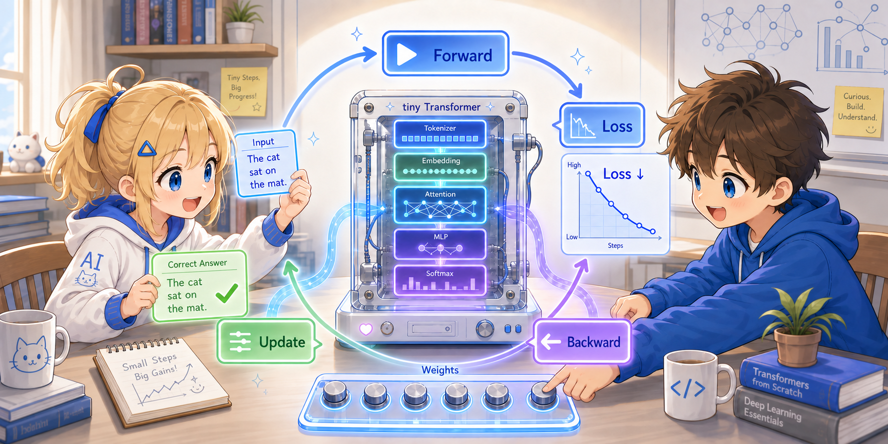
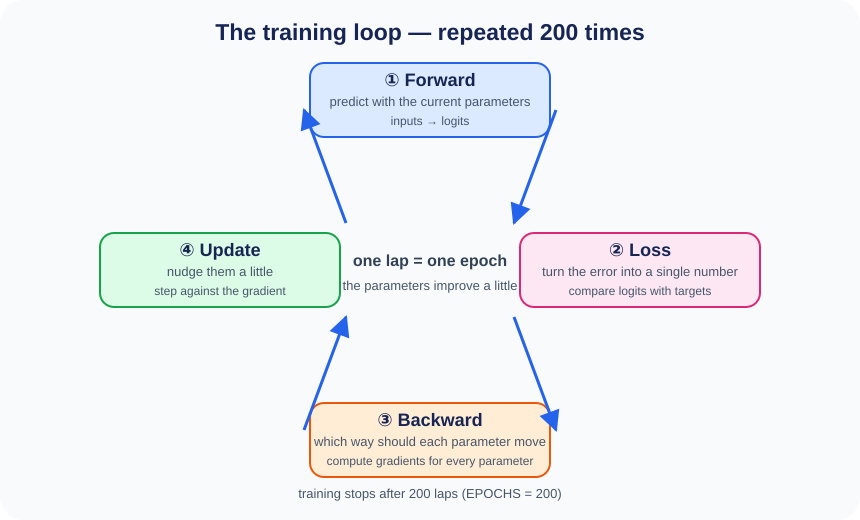

# Chapter 3: Training — How Does the Model Get Smarter?



In the previous chapter we saw how the input is processed into `logits` (the score for each word).
In this chapter we explain the mechanism of the **training loop**, which compares those scores with
the correct answers and updates the parameters.

---

## 3.1 The Big Picture of Training

At the end of Chapter 2, the model got some of its 12 predictions wrong.
That is only natural, since parameters such as `tok_emb` and `Wq` start out as random values.

Training is **the work of gradually reducing how often it gets things wrong**.
What we do is simple — just repeat the following four things.

1. **Forward** — with the current parameters, just go ahead and make a prediction
2. **Loss** — condense how far that prediction is from the correct answer into a single number
3. **Backward** — find out which parameters to move in which direction in order to make that number smaller
4. **Update** — move the parameters just a tiny bit in the direction we found



After one round the parameters become a tiny bit "better", and the prediction moves slightly closer to the answer.
It does not become dramatically smarter in one go; in this project we repeat this
**200 times** (`EPOCHS = 200`).

The "number summarizing how far off it is" in ② is called the **loss**,
and "which direction to move" in ③ is called the **gradient**.
We will explain both of them in turn in this chapter.

---

## 3.2 The Whole Code

```python
def train(model, inputs, targets):
    optimizer = torch.optim.Adam(model.parameters(), lr=LR)

    for epoch in range(EPOCHS):
        logits = model.forward(inputs)               # ① Forward
        loss = F.cross_entropy(                       # ② Loss
            logits.view(-1, model.vocab_size),
            targets.view(-1),
        )

        optimizer.zero_grad()                         # reset the previous gradients
        loss.backward()                               # ③ Backward (automatic differentiation)
        optimizer.step()                              # ④ Update

        if (epoch + 1) % 20 == 0:
            print(f"epoch {epoch+1:4d}  loss={loss.item():.4f}")
```

>
> **Python Tips: `loss.item()` and f-strings**
>
> **`.item()`** extracts an ordinary Python number out of a tensor:
> ```python
> t = torch.tensor(3.14)
> t          # → tensor(3.14)   ← tensor type
> t.item()   # → 3.14           ← float type
> ```
>
> **An f-string** `f"..."` is a string you can embed variables in. After the `:` comes the format spec:
> ```python
> x = 42
> pi = 3.14159
> f"x={x:4d}"      # → "x=  42"      a 4-digit integer (right-aligned)
> f"pi={pi:.4f}"    # → "pi=3.1416"   4 digits after the decimal point
> ```

Below we look at each step in detail.

---

## 3.3 ① Forward — Producing a Prediction

```python
logits = model.forward(inputs)   # (28, 12, 10)
```

This is exactly the processing explained in the previous chapter. For each of 28 samples (1 batch) × 12 positions,
a "score" for 10 words is output.

---

## 3.4 ② Cross-Entropy Loss — Comparing Prediction and Answer

### What Is Being Computed

```python
loss = F.cross_entropy(
    logits.view(-1, model.vocab_size),   # (336, 10) ← 28×12=336 predictions
    targets.view(-1),                     # (336,)    ← 336 correct answers
)
```

These two lines are a little hard to follow, so let's go through them carefully.

### The Shapes of `logits` and `targets`

The result of Forward, `logits`, is a 3-dimensional tensor:

```
Shape of logits: (28, 12, 10)
                  ↑   ↑   ↑
                  |   |   └─ the score for each of the 10 words (prediction of the next word)
                  |   └───── 12 predictions (for each input word, predict "the next word")
                 └───────── 28 samples (1 batch in this example)
```

As we saw in Chapter 1, the input and the answer are in a "shifted by one" relationship:

```
input:   the  cat  sat  on  the  mat   .  the  dog  sat  on  the
answer:  cat  sat  on   the mat   .   the dog  sat  on   the log
```

Each position of logits holds **the scores predicting "the word that comes next", based on the context up to that position**.
For example, the logits at position 3 ("on") are the scores over 10 words for
"the word that comes after "the cat sat on"". The correct answer is "the".

`targets` holds the word number of the correct answer corresponding to each position:

```
Shape of targets: (28, 12)
                   ↑   ↑
                   |   └─ the correct word number at each position (= the word that should come next)
                   └───── 28 samples (1 batch in this example)
```

In other words, there are 28 samples (1 batch) × 12 positions = **336 "next word" predictions**,
and each one has **one correct answer**.

### Why Change the Shape with `view`

`F.cross_entropy` requires the following shapes:

- 1st argument: `(number of predictions, number of classes)` — 2-dimensional
- 2nd argument: `(number of predictions,)` — 1-dimensional

But `logits` is 3-dimensional at `(28, 12, 10)`, and `targets` is 2-dimensional at `(28, 12)`.
So we use `view` to line up "28 samples (1 batch) × 12 positions" into a single row:

```
logits:  (28, 12, 10)  →  view(-1, 10)  →  (336, 10)
                                               ↑    ↑
                                              336    scores for 10 words

targets: (28, 12)      →  view(-1)      →  (336,)
                                               ↑
                                              336 correct answer numbers
```

The order they line up in is: sample 0's positions 0–11, then sample 1's positions 0–11, and so on.
It is a rearrangement for **evaluating the 336 predictions all at once, doing away with the distinction
of "which position of which sample"**.

>
> **Python Tips: `.view(-1, ...)` — `-1` means "compute automatically"**
>
> If you specify `-1` in `.view()`, the size is computed automatically from the other dimensions:
> ```python
> x = torch.zeros(28, 12, 10)      # 28×12×10 = 3360 elements
>
> x.view(-1, 10)    # → shape: (336, 10)   -1 → 3360÷10 = 336
> x.view(-1)        # → shape: (3360,)     completely flattened to 1 dimension
> ```

### The Meaning of Cross-Entropy Loss

Suppose the logits at a certain position are `[0.1, 2.5, 0.3, -0.1, ...]`,
and the correct answer is word number `1` ("the").

**Step 1: Convert into probabilities with Softmax**

$$p_i = \frac{e^{\text{logit}_i}}{\sum_j e^{\text{logit}_j}}$$

```
logits:  [0.1,  2.5,  0.3, -0.1,  0.5, -0.2,  0.4, -0.1,  0.6,  0.0]
softmax: [0.05, 0.52, 0.06, 0.04, 0.07, 0.04, 0.06, 0.04, 0.08, 0.04]
                 ↑
              52% probability on the correct "the" → still low
```

**Step 2: The negative log of the probability of the correct answer**

$$\text{loss} = -\log(p_{\text{correct}})$$

```
loss = -log(0.52) = 0.65
```

- the probability of the correct answer is close to 1.0 → loss ≈ 0 (a good prediction)
- the probability of the correct answer is close to 0.0 → loss → ∞ (a bad prediction)

### How the Loss Evolves

Looking at an actual run (the numbers change from run to run, but the trend is the same):

```
epoch   20  loss=1.9469    ← nearly random prediction (for 10 words, -log(1/10) ≈ 2.30)
epoch   40  loss=1.5257
epoch   60  loss=0.8140
epoch   80  loss=0.5469
epoch  100  loss=0.3880    ← predicting fairly accurately
epoch  120  loss=0.3099
epoch  140  loss=0.2568
epoch  160  loss=0.2227
epoch  180  loss=0.1862
epoch  200  loss=0.1147    ← predicting almost perfectly
```

The loss falls from around 2.3 (random) to 0.11 (almost always correct).

---


## 3.5 ③ Backward — Backpropagation

```python
optimizer.zero_grad()
loss.backward()
```

### What Is a "Gradient"?

> The mathematical details of gradients are explained with concrete numerical examples in
> [Supplement: Mathematical Intuition for Gradients](03a_gradient.md).

The loss `loss` is a function of all the parameters.
"If I increase a certain parameter a little, how much does the loss change?" —
this is the **gradient**.

Written as a formula, the gradient with respect to a parameter $\theta$ is:

$$\frac{\partial \text{loss}}{\partial \theta}$$

- the gradient is **positive** → **decreasing** that parameter lowers the loss
- the gradient is **negative** → **increasing** that parameter lowers the loss

### How Backpropagation Works

`loss.backward()` uses the **chain rule** to
propagate gradients backward, from the output toward the input.

```
tok_emb → Embedding → Attention → FFN → logits → loss
  ←─────────────────────────────────────────────────
          backward: the gradients flow backward from loss
```

The chain rule is:

$$\frac{\partial \text{loss}}{\partial W_q} = \frac{\partial \text{loss}}{\partial \text{logits}} \cdot \frac{\partial \text{logits}}{\partial \text{attn}} \cdot \frac{\partial \text{attn}}{\partial W_q}$$

Simply by multiplying together the local derivatives of each layer, we obtain the gradients of all parameters.

> **PyTorch's autograd**: With a single line, `loss.backward()`, it automatically computes the
> gradients of every computation performed in forward. In this program we write forward
> by hand and leave backward to PyTorch.

### Why `zero_grad()` Is Necessary

Because PyTorch **accumulates** gradients, if you don't reset them every time, the previous
gradients stick around.

---

## 3.6 ④ Update — Updating the Parameters

```python
optimizer.step()
```

### The Basic Update Rule (Gradient Descent)

$$\theta \leftarrow \theta - \eta \cdot \frac{\partial \text{loss}}{\partial \theta}$$

$\eta$ (the learning rate, `LR = 0.001`) is "how far to move in one update".

```
Example:
  when an element of W_q is 0.05 and the gradient is +0.2
  → new value = 0.05 - 0.001 × 0.2 = 0.0498
  → it moved a little in the direction that lowers the loss
```

### The Adam Optimizer

This program uses **Adam** rather than plain gradient descent.
Adam is a method that automatically adjusts the learning rate for each parameter, and it converges quickly.

- parameters that are updated frequently → smaller learning rate
- parameters that are rarely updated → larger learning rate

---

## 3.7 Following the Whole Course of Training


Only the values of the parameters change; the contents of the loop (Forward → Loss → Backward → Update)
never change even once from beginning to end.

---

## 3.8 What Gets Learned

A list of this program's parameters:

| Parameter | Shape | What it learns |
|-----------|------|-----------|
| `tok_emb` | (10, 64) | the token embedding of each word |
| `pos_emb` | (12, 64) | the positional embedding of each position |
| `Wq, Wk, Wv` | (64, 64) ×3 ×2 layers | how Attention makes its queries |
| `Wo` | (64, 64) ×2 layers | how the Attention output is integrated |
| `W1, b1` | (64,128), (128,) ×2 layers | the FFN transformation (first half) |
| `W2, b2` | (128,64), (64,) ×2 layers | the FFN transformation (second half) |
| `ln*_g, ln*_b` | (64,) various | the scale and shift of Layer Norm |

All of these get adjusted little by little, over 200 rounds of training,
**in the direction that minimizes the loss**.

---

## Summary

```
Forward:   inputs → prediction (logits)
                          ↓
Loss:      the difference between prediction and answer → a single number
                          ↓
Backward:  automatically compute the gradients of all parameters
                          ↓
Update:    use the gradients to fine-tune the parameters
                          ↓
           repeat → the loss keeps getting smaller and smaller
```

| Concept | Meaning |
|------|------|
| loss | a measure of how wrong the predictions are |
| gradient | the direction and magnitude in which to move the parameters |
| backprop | a method for computing gradients efficiently with the chain rule |
| learning rate (LR) | how far to move in one update |
| epoch | one pass through the training data |
