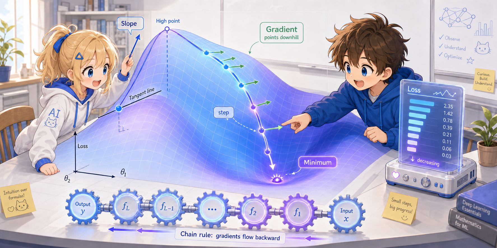
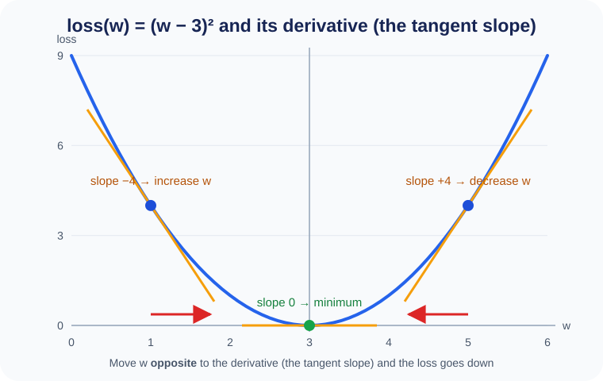
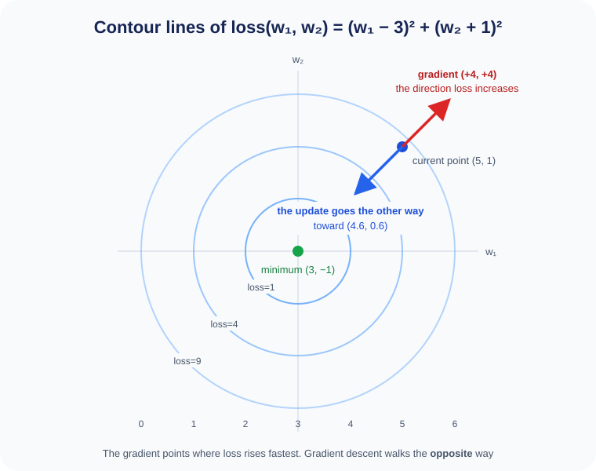

# Supplement: Mathematical Intuition for Gradients



The "gradient" appeared in Chapter 3.
Here we explain the meaning of the gradient mathematically, using concrete numbers.

---

## The One-Variable Case — Derivatives

Let's start from the simplest case.

Suppose there is only one parameter ($w$), and the loss is the following function:

$$\text{loss}(w) = (w - 3)^2$$

This function takes its minimum value of 0 when $w = 3$.

The **derivative** is the ratio "when $w$ moves a little, how much does the loss change":

$$\frac{d\thinspace \text{loss}}{d\thinspace w} = 2(w - 3)$$

Let's look at it with concrete values:

```
when w = 5.0:
  loss = (5-3)² = 4.0
  derivative = 2(5-3) = +4.0    ← positive: decreasing w lowers the loss

when w = 1.0:
  loss = (1-3)² = 4.0
  derivative = 2(1-3) = -4.0    ← negative: increasing w lowers the loss

when w = 3.0:
  loss = (3-3)² = 0.0
  derivative = 2(3-3) = 0.0     ← zero: we have reached the optimal point
```

The **update rule** moves $w$ in the **opposite direction** of the derivative:

$$w \leftarrow w - \eta \cdot \frac{d\thinspace \text{loss}}{d\thinspace w}$$

With $\eta = 0.1$ (the learning rate):

```
Step 1:      w = 5.0  →  5.0 - 0.1 × 4.0  = 4.6
Step 2:      w = 4.6  →  4.6 - 0.1 × 3.2  = 4.28
Step 3:      w = 4.28 →  4.28 - 0.1 × 2.56 = 4.024
  ...gradually getting closer to w = 3.0
```



Looking at the figure makes it easier to understand. If you draw a tangent line at each point of the parabola, its slope is the derivative.
If the slope is positive go left, if negative go right — that is, if you move in **the opposite direction of the slope**, you always get closer to the bottom of the valley.

This is the essence of **Gradient Descent**.

---

## The Two-Variable Case — Partial Derivatives

Once there are two parameters ($w_1, w_2$), we use **partial derivatives**:

$$\text{loss}(w_1, w_2) = (w_1 - 3)^2 + (w_2 + 1)^2$$

The minimum is loss = 0 at $w_1 = 3, w_2 = -1$.

A partial derivative is "the rate of change when you fix the other parameters and move only one":

$$\frac{\partial\thinspace \text{loss}}{\partial\thinspace w_1} = 2(w_1 - 3), \quad \frac{\partial\thinspace \text{loss}}{\partial\thinspace w_2} = 2(w_2 + 1)$$

The vector gathering these two together is the **gradient**:

$$\nabla \text{loss} = \left(\frac{\partial\thinspace \text{loss}}{\partial\thinspace w_1},\thinspace \frac{\partial\thinspace \text{loss}}{\partial\thinspace w_2}\right)$$

The update is performed on each parameter **simultaneously**:

```
when w1 = 5.0, w2 = 1.0:
  ∂loss/∂w1 = 2(5-3)  = +4.0
  ∂loss/∂w2 = 2(1+1)  = +4.0

Update:
  w1 = 5.0 - 0.1 × 4.0 = 4.6
  w2 = 1.0 - 0.1 × 4.0 = 0.6
```



With two variables, the loss becomes a "bowl-shaped terrain".
If you draw the lines connecting points of the same height (contour lines), the center (3, −1) is the bottom of the valley.
Since the gradient $\nabla\text{loss}$ is a vector pointing in **the direction in which the loss increases most steeply**,
taking one step in the opposite direction is what the update amounts to.

Even with two variables, we just do the same thing as with one variable, **independently for each parameter**.

---


## The 68,000-Variable Case — tiny-LLM

tiny-LLM has about 68,000 parameters.
But what it does is exactly the same as the two-variable case:

$$w_i \leftarrow w_i - \eta \cdot \frac{\partial\thinspace \text{loss}}{\partial\thinspace w_i} \quad (i = 1, 2, \ldots, 68000)$$

Working out 68,000 partial derivatives one by one by hand is impossible.
But if we use the **chain rule**, they can be computed mechanically.

---

## The Chain Rule

The derivative of a composite function $y = f(g(x))$ is:

$$\frac{dy}{dx} = \frac{dy}{dg} \cdot \frac{dg}{dx}$$

Let's look at a concrete example. When $g(x) = 2x + 1$ and $f(g) = g^2$:

```
when x = 3:
  g = 2×3 + 1 = 7
  y = 7² = 49

  dg/dx = 2
  dy/dg = 2g = 14
  dy/dx = 14 × 2 = 28     ← just a multiplication
```

A Transformer is a composition of a great many functions:

```
x → Embedding → Attention → FFN → ... → logits → loss
```

Applying the chain rule repeatedly:

$$\frac{\partial\thinspace \text{loss}}{\partial\thinspace W_q} = \frac{\partial\thinspace \text{loss}}{\partial\thinspace \text{logits}} \cdot \frac{\partial\thinspace \text{logits}}{\partial\thinspace \text{attn}} \cdot \frac{\partial\thinspace \text{attn}}{\partial\thinspace W_q}$$

**Simply by multiplying the local derivatives of each layer**, we also obtain the gradients of the parameters close to the input.

This is **Backpropagation**.
PyTorch's `loss.backward()` performs this chain-rule computation automatically.

---

## Summary

| Concept | Meaning |
|------|------|
| derivative $\frac{d\thinspace \text{loss}}{dw}$ | how much the loss changes when $w$ moves a little |
| partial derivative $\frac{\partial\thinspace \text{loss}}{\partial w_i}$ | the rate of change when the others are fixed and only $w_i$ moves |
| gradient $\nabla\text{loss}$ | a vector gathering the partial derivatives of all parameters |
| chain rule | obtaining the derivative of a composite function as the product of the derivatives of each stage |
| gradient descent | moving the parameters in the opposite direction of the gradient to lower the loss |
| `loss.backward()` | automatically applying the chain rule to compute the gradients of all parameters |

The important thing is that, whether there is 1 variable or 68,000, **the principle is the same**.
"Move each parameter a little in the direction that lowers the loss" — we just repeat that.
