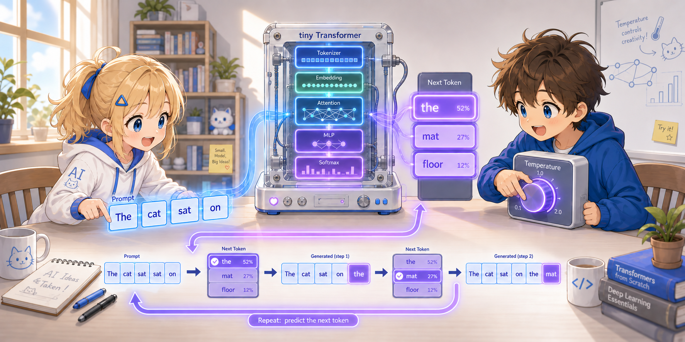

# Chapter 4: Text Generation — Predicting the Next Word



Training is finished. All of the model's parameters have been adjusted
so that it "can correctly predict the next word".

In this chapter we look at the mechanism for **generating new text** using the trained model.
This is where the essence of an LLM lies.

---

## 4.1 The Essence of an LLM: Predicting the Next Word

ChatGPT and GPT-4 are, fundamentally, doing the same thing:

> **"Given the sequence of words so far, predict the word that comes next"**

Just by repeating this, text gets generated.

```
input:       "the cat"
prediction:  "sat"        ← predict the next single word

input:       "the cat sat"
prediction:  "on"         ← predict the next single word again

input:       "the cat sat on"
prediction:  "the"        ← predict yet another next single word

...repeat this
```

---

## 4.2 The Code — The `generate` Function

```python
def generate(model, prompt, vocab, id2word, max_tokens=20):
    tokens = tokenize(prompt, vocab)

    with torch.no_grad():                                # no gradient computation needed at inference
        for _ in range(max_tokens):
            context = tokens[-SEQ_LEN:]                  # take the most recent 12 tokens
            x = torch.tensor([context])                  # (1, T)
            logits = model.forward(x)                    # (1, T, 10)
            next_logit = logits[0, -1, :]                # scores at the last position
            next_id = torch.argmax(next_logit).item()    # the word with the highest score
            tokens.append(next_id)

    return " ".join(id2word[t] for t in tokens)
```

>
> **Python Tips: `" ".join(...)` — joining a list into a string**
>
> `" ".join(list)` connects the elements of a list with spaces into a single string:
> ```python
> words = ["the", "cat", "sat"]
> " ".join(words)     # → "the cat sat"
> "-".join(words)     # → "the-cat-sat"
> ```
> `id2word[t] for t in tokens` is a **generator expression**;
> it converts each token number into a word while passing them to `join`.

### Step-by-Step Explanation

**Step 1: Tokenize the prompt**

```python
tokens = tokenize("the cat sat on", vocab)
# → [1, 2, 3, 4]
```

**Step 2: Run it through the Transformer**

```python
context = tokens[-SEQ_LEN:]    # [1, 2, 3, 4]  ← the most recent 12 tokens (only 4 for now)
x = torch.tensor([context])    # shape: (1, 4)
logits = model.forward(x)      # shape: (1, 4, 10)
```

The **1** at the head of the shape is the number of batches (sets).
In training we pushed 28 sets through together, but what we feed in at generation time
is only the single context we currently have, so the batch size is 1.
The reason `context` is wrapped one level deep in a list as `torch.tensor([context])`
is to create this axis for the one set.

Predictions come out at all 4 positions, but the only one we need is **the last position**.
(The last position = "the prediction made after having seen all the context up to here".)

**Step 3: Choose the next word**

```python
next_logit = logits[0, -1, :]   # (10,) ← the scores at the last position
# e.g.: [0.1, 2.8, -0.2, 0.1, 0.8, 0.3, -0.3, -0.1, 0.4, 0.0]
#        pad   the   cat  sat   on   mat    .   dog   log  saw

next_id = torch.argmax(next_logit).item()   # → 1 (= "the")
```

>
> **Python Tips: Multi-dimensional tensor indexing `logits[0, -1, :]`**
>
> You specify the position along each axis, separated by commas. `-1` is "the last", `:` is "all of them":
> ```python
> x = torch.zeros(3, 4, 10)   # 3 samples × 4 positions × 10 words
>
> x[0]         # → shape: (4, 10)   the whole of the first sample
> x[0, -1]     # → shape: (10,)     the last position of the first sample
> x[0, -1, :]  # → shape: (10,)     same as above (: means "all", so it can be omitted)
> x[0, -1, 3]  # → scalar           one specific element
> ```

>
> **Python Tips: `torch.argmax()` — the index of the maximum value**
>
> It returns the **position (index)** of the largest value in a tensor:
> ```python
> scores = torch.tensor([0.1, 0.3, 2.1, -0.5, 0.8])
> torch.argmax(scores)          # → tensor(2)   ← 2.1 is the max, and its position is 2
> torch.argmax(scores).item()   # → 2            ← .item() turns it into a Python int
> ```

The **0** in `logits[0, -1, :]` points to "the one and only set"
(unlike the 28 sets during training, there is only one row in here).
The **-1** is the last position, and the **:** is the scores for the 10 words of the vocabulary.

`argmax` returns the index with the highest score.
→ It predicts that "the" comes after "the cat sat on" (in the corpus, "on" is always followed by "the").

**Step 4: Add the predicted word to the input and do it again**

This is the heart of generation. The `"the"` (word number 1) predicted in Step 3 is
**appended as-is to the end of the token sequence that was the input**.

```python
tokens.append(1)
# before: [1, 2, 3, 4]      ← "the cat sat on"       (the original prompt)
# after:  [1, 2, 3, 4, 1]   ← "the cat sat on the"   (the predicted "the" was added)
```

Then, on the next loop iteration, these 5 words become the new input.
From the model's point of view, the answer it just produced comes back as "the context to be read".
Reading 5 words to predict the 6th, appending that to the end again, and so on —
by repeating this, the text keeps growing.

"If you append the predicted word to the end of the input, you can do the same thing again",
mentioned at the end of Chapter 2, is realized by the single line `tokens.append()`.

### The Flow of Generation (A Concrete Example)

The input grows by one word per step.
The next input is the previous step's input with the predicted word appended.

| Step | Input (the token sequence handed to the model) | Length | Prediction |
|---|---|---|---|
| 1 | `the cat sat on` | 4 | `the` |
| 2 | `the cat sat on the` | 5 | `mat` |
| 3 | `the cat sat on the mat` | 6 | `.` |
| 4 | `the cat sat on the mat .` | 7 | `the` |
| 5 | `the cat sat on the mat . the` | 8 | `dog` |
| … | (grows by one word per step) | … | … |

Once the length exceeds `SEQ_LEN = 12`, `tokens[-SEQ_LEN:]` makes the words
**drop out of the context starting from the oldest**, so only the most recent 12 words are ever handed to the model
(this is the context-length story from Chapter 1).

---


## 4.3 The Limits of Greedy Decoding

This program uses `argmax` (choosing the word with the highest score).
This is called **Greedy Decoding**.

```
scores: [0.1, 0.3, -0.2, 0.1, 0.8, 2.1, -0.3, -0.1, 0.4, 0.0]
```

In this example, the maximum value **2.1** is always chosen.

It is simple, but because it only ever picks "the word with the highest probability",
it has the drawback of easily looping over the same pattern.

> For this reason, in generation it is common to introduce diversity with techniques such as
> sampling from the probability distribution (temperature) or choosing from the top k candidates (top-k).

### How Does Temperature Work?

Temperature is a coefficient that decides how much to "sharpen / flatten" the logits before sampling.

$$p_i = \text{softmax}\left(\frac{\text{logit}_i}{T}\right)$$

We use this $p_i$ as the **probability of the next word**, and pick one word from it to decide the next word
(in the case of temperature sampling).

- `T < 1.0`: the distribution sharpens (concentrating on high-scoring words) → the output is more deterministic
- `T = 1.0`: use the model's own distribution as-is
- `T > 1.0`: the distribution flattens (probability goes to low-scoring words too) → the output is more diverse

Intuitively, lowering `T` makes it "cautious" and raising it makes it "adventurous".
When `T` is extremely small it approaches `argmax`, and when extremely large it approaches near-randomness.

* The `generate()` implementation in this file remains Greedy (`argmax`); temperature sampling is not implemented.

---

## 4.4 Looking at the Run Results

```
prompt: "the cat sat on"
output: the cat sat on the mat . the dog sat on the log .
        the cat saw the dog . the dog saw the

prompt: "the dog saw"
output: the dog saw the cat . the cat sat on the log .
        the dog sat on the mat . the dog sat
```

Natural sentences in line with the training corpus are being generated.
This looks like it is merely memorizing the corpus by rote — and
in fact that is exactly right. With only 40 words and a 10-word vocabulary, rote memorization is the optimal solution.

---

## 4.5 The Difference in Scale

Let's line up tiny-LLM and a GPT-4 class model.

| | tiny-LLM | GPT-4 class |
|---|---|---|
| Vocabulary size | 10 | 100,000+ |
| Embedding dimension | 64 | 12,288+ |
| Number of attention heads | 4 | 96+ |
| Number of Transformer layers | 2 | 96+ |
| Number of parameters | about 68,000 | hundreds of billions to trillions |
| Training data | 40 tokens | trillions of tokens |
| Training time | a few seconds | several months (thousands of GPUs) |

As you scale up, **generalization** starts to happen instead of rote memorization.
Being able to predict an appropriate next word from learned patterns even for
"text it has never seen" — that is the power of large language models.

---

## Summary

```
"the cat sat on"
       ↓
   Transformer (trained)
       ↓
   predicts "the"
       ↓
"the cat sat on the"
       ↓
   Transformer
       ↓
   predicts "mat"
       ↓
   ...repeat
```

**Everything about an LLM boils down to "predicting the next word".**

- Embedding gives meaning to words
- Self-Attention understands context
- Training raises the accuracy of the prediction
- Generation repeats the prediction

tiny-LLM is a small toy, but
the core of the Transformer implemented here — Self-Attention, Q/K/V, residual connections,
Layer Norm, and "predicting the next word" — is something you have assembled with your own hands.
