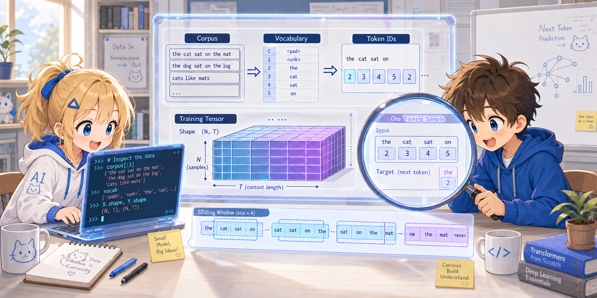

# Step 2: Exploring the Data



Let's check the contents of the data handed to the Transformer with our own eyes.

Try the following in Python's interactive mode (or a Jupyter Notebook).

---

## 2.1 Starting Interactive Mode

```bash
uv run --with torch python -i tiny_llm.py
```

With `python -i`, after running the script you drop straight into interactive mode.
Variables such as `model`, `vocab`, and `id2word` are available as-is.

---

## 2.2 Checking the Vocabulary

```python
>>> vocab
{'<pad>': 0, 'the': 1, 'cat': 2, 'sat': 3, 'on': 4, 'mat': 5, '.': 6, 'dog': 7, 'log': 8, 'saw': 9}

>>> len(vocab)
10
```

It is a vocabulary of just 10 words. Each word is assigned a number from 0 to 9.

---

## 2.3 Trying Out Tokenization

```python
>>> tokenize("the cat sat on the mat", vocab)
[1, 2, 3, 4, 1, 5]
```

The text is converted into a sequence of numbers. `"the"` is `1` wherever it appears.

Let's check the reverse direction too:

```python
>>> [id2word[i] for i in [1, 2, 3, 4, 1, 5]]
['the', 'cat', 'sat', 'on', 'the', 'mat']
```

---

## 2.4 Checking the Shape of the Training Data

```python
>>> inputs, targets = make_training_data(corpus, vocab)

>>> inputs.shape
torch.Size([28, 12])

>>> targets.shape
torch.Size([28, 12])
```

28 samples (1 batch), and each sample is 12 tokens long.

---

## 2.5 Looking at One Sample in Detail

```python
>>> inputs[0]
tensor([1, 2, 3, 4, 1, 5, 6, 1, 7, 3, 4, 1])

>>> [id2word[i.item()] for i in inputs[0]]
['the', 'cat', 'sat', 'on', 'the', 'mat', '.', 'the', 'dog', 'sat', 'on', 'the']
```

This is the input to the Transformer. Next, let's look at the corresponding correct answer:

```python
>>> targets[0]
tensor([2, 3, 4, 1, 5, 6, 1, 7, 3, 4, 1, 8])

>>> [id2word[i.item()] for i in targets[0]]
['cat', 'sat', 'on', 'the', 'mat', '.', 'the', 'dog', 'sat', 'on', 'the', 'log']
```

Let's line up the input and the answer:

```
input:  the  cat  sat  on  the  mat   .  the  dog  sat  on  the
answer: cat  sat  on   the mat   .   the dog  sat  on   the log
```

You can see that at each position the "next word" is the correct answer.

---

## 2.6 Checking the Sliding Window

The second sample is shifted by one word:

```python
>>> [id2word[i.item()] for i in inputs[1]]
['cat', 'sat', 'on', 'the', 'mat', '.', 'the', 'dog', 'sat', 'on', 'the', 'log']
```

```
sample 0: the cat sat on the mat .  the dog sat on the
sample 1:     cat sat on the mat .  the dog sat on the log
sample 2:         sat on the mat .  the dog sat on the log .
```

The window slides one word at a time, producing 28 samples.

---

## 2.7 Key Points So Far

- **Vocabulary (vocab)**: nothing more than numbering 10 words
- **Tokenization**: converting text into a sequence of numbers
- **Training data**: sliding a 12-token window to create pairs of input and answer (shifted by one)
- **The model's task**: to predict the "next word" at each position

The data is extremely simple. In the next step, we'll peek inside
the Transformer that processes this data.

---

Next: [Step 3: Peeking Inside the Transformer](03_explore_model.md)
