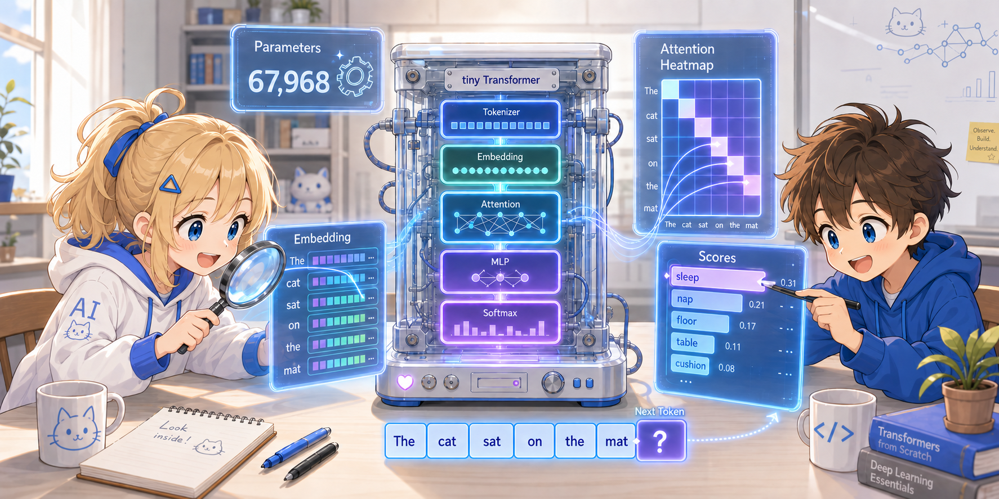

# Step 3: Peeking Inside the Transformer



Let's actually observe the internals of the trained model.
We'll check what values the Embedding vectors and Attention weights actually take.

We continue working in the interactive mode of `uv run --with torch python -i tiny_llm.py`.

---

## 3.1 Checking the Number of Parameters

```python
>>> total = sum(p.numel() for p in model.parameters())
>>> print(f"Total parameters: {total}")
Total parameters: 67968
```

About 68,000 parameters (mostly weight matrices) were adjusted over 200 rounds of training.

---

## 3.2 Observing the Embedding Vectors

Each word is represented by a 64-dimensional vector:

```python
>>> model.tok_emb.shape
torch.Size([10, 64])
```

Let's look at the first 10 elements of the vector for "cat" (number 2):

```python
>>> model.tok_emb[2][:10]
tensor([-0.05,  0.13,  0.27, ...], requires_grad=True)
```

The numbers are learned from a random initialization on each training run, so they change every time you run it.

Through training, words with similar roles should have ended up with similar vectors.
Let's check with cosine similarity:

```python
>>> import torch.nn.functional as F
>>>
>>> def similarity(word1, word2):
...     v1 = model.tok_emb[vocab[word1]]
...     v2 = model.tok_emb[vocab[word2]]
...     return F.cosine_similarity(v1.unsqueeze(0), v2.unsqueeze(0)).item()
...
>>> similarity("cat", "dog")    # used in similar contexts
>>> similarity("cat", ".")      # completely different roles
>>> similarity("mat", "log")    # both come after "sat on the ___"
```

<details>
<summary>For copy-paste (without prompt markers)</summary>

The raw code with `>>>` / `...` removed. It **can be pasted directly** into interactive mode.

```python
import torch.nn.functional as F

def similarity(word1, word2):
    v1 = model.tok_emb[vocab[word1]]
    v2 = model.tok_emb[vocab[word2]]
    return F.cosine_similarity(v1.unsqueeze(0), v2.unsqueeze(0)).item()

similarity("cat", "dog")    # used in similar contexts
similarity("cat", ".")      # completely different roles
similarity("mat", "log")    # both come after "sat on the ___"
```

</details>

If the similarity between "cat" and "dog" is high and the similarity between "cat" and "." is low,
it shows that the model has learned (if only a little) the semantic relationships between words.

---

## 3.3 Peeking at the Attention Weights

The core of the Transformer is the **Attention weight matrix**, which expresses "which token is attending to where". Let's pull out the attention weights of layer 1 and have a look.

The details of the computation are explained at length in the main text, [Chapter 2: Self-Attention](../02_transformer.md), so here we concentrate on **looking at the results**. Paste the following helper into interactive mode:

```python
>>> import math
>>> def attn_layer0(text):
...     x = torch.tensor([tokenize(text, vocab)])
...     T = x.shape[1]
...     emb = model.tok_emb[x] + model.pos_emb[:T]
...     L = model.layers[0]
...     n = layer_norm(emb, L["ln1_g"], L["ln1_b"])
...     Q, K = n @ L["Wq"], n @ L["Wk"]
...     scores = (Q @ K.transpose(-2, -1)) / math.sqrt(64)
...     mask = torch.triu(torch.ones(T, T), diagonal=1).bool()
...     return torch.softmax(scores.masked_fill(mask, float("-inf")), dim=-1)[0]
...
```

<details>
<summary>For copy-paste (without prompt markers)</summary>

The raw code with `>>>` / `...` removed. It **can be pasted directly** into interactive mode.

```python
import math

def attn_layer0(text):
    x = torch.tensor([tokenize(text, vocab)])
    T = x.shape[1]
    emb = model.tok_emb[x] + model.pos_emb[:T]
    L = model.layers[0]
    n = layer_norm(emb, L["ln1_g"], L["ln1_b"])
    Q, K = n @ L["Wq"], n @ L["Wk"]
    scores = (Q @ K.transpose(-2, -1)) / math.sqrt(64)
    mask = torch.triu(torch.ones(T, T), diagonal=1).bool()
    return torch.softmax(scores.masked_fill(mask, float("-inf")), dim=-1)[0]
```

</details>

Let's run it:

```python
>>> attn = attn_layer0("the cat sat on the mat")
>>> print(attn.detach().round(decimals=2))
```

A 6×6 attention weight matrix is displayed. Each row shows "where that position is attending to":

```
row 0 (the): [1.00, 0.00, 0.00, 0.00, 0.00, 0.00]   ← can only see itself
row 1 (cat): [0.??, 0.??, 0.00, 0.00, 0.00, 0.00]   ← can see the and cat
row 2 (sat): [0.??, 0.??, 0.??, 0.00, 0.00, 0.00]
...
```

**The fact that the upper-right triangle is 0 is the effect of the causal mask** — the mechanism that "forbids looking at future tokens" can be confirmed numerically, just like this.

> If you want to see the differences between the multi-heads (4 heads), try splitting the helper's `Q` and `K` into 4 heads and running the same computation. The procedure is in the main text, [§2 Multi-Head Attention](../02_transformer.md).

---

## 3.4 (Optional) Drawing the Attention as a Heatmap

Seeing it with your eyes is easier than a table of numbers, so if you have matplotlib, let's visualize it.

```bash
# first start interactive mode with matplotlib installed
uv run --with torch --with matplotlib python -i tiny_llm.py
```

After pasting the helper `attn_layer0` from §3.3 again:

```python
>>> import matplotlib.pyplot as plt
>>> tokens = "the cat sat on the mat".split()
>>> attn = attn_layer0("the cat sat on the mat")
>>>
>>> fig, ax = plt.subplots(figsize=(5, 4))
>>> im = ax.imshow(attn.detach().numpy(), cmap="Blues")
>>> ax.set_xticks(range(6)); ax.set_yticks(range(6))
>>> ax.set_xticklabels(tokens); ax.set_yticklabels(tokens)
>>> ax.set_xlabel("attended to"); ax.set_ylabel("from position")
>>> plt.colorbar(im)
>>> plt.tight_layout(); plt.show()
```

<details>
<summary>For copy-paste (without prompt markers)</summary>

The raw code with `>>>` removed. It **can be pasted directly** into interactive mode.

```python
import matplotlib.pyplot as plt
tokens = "the cat sat on the mat".split()
attn = attn_layer0("the cat sat on the mat")

fig, ax = plt.subplots(figsize=(5, 4))
im = ax.imshow(attn.detach().numpy(), cmap="Blues")
ax.set_xticks(range(6)); ax.set_yticks(range(6))
ax.set_xticklabels(tokens); ax.set_yticklabels(tokens)
ax.set_xlabel("attended to"); ax.set_ylabel("from position")
plt.colorbar(im)
plt.tight_layout(); plt.show()
```

</details>

You should see a pattern where only the lower triangle is colored (the upper-right causal mask part is white) and the area near the diagonal is dark.
Drawing and comparing the different attention patterns per head gives you an intuitive feel for the significance of Multi-Head Attention.

---

## 3.5 Following the Generation Process One Step at a Time

```python
>>> # predict the next word from "the cat sat on"
>>> prompt = "the cat sat on"
>>> tokens = tokenize(prompt, vocab)
>>> print(tokens)
[1, 2, 3, 4]

>>> # Forward pass
>>> x = torch.tensor([tokens])
>>> logits = model.forward(x)          # (1, 4, 10)
>>> next_logit = logits[0, -1, :]      # the scores at the last position

>>> # display the score of each word
>>> for i, score in enumerate(next_logit.tolist()):
...     print(f"  {id2word[i]:>5s}: {score:.3f}")
```

<details>
<summary>For copy-paste (without prompt markers)</summary>

The raw code with `>>>` / `...` removed. It **can be pasted directly** into interactive mode.

```python
# predict the next word from "the cat sat on"
prompt = "the cat sat on"
tokens = tokenize(prompt, vocab)
print(tokens)

# Forward pass
x = torch.tensor([tokens])
logits = model.forward(x)          # (1, 4, 10)
next_logit = logits[0, -1, :]      # the scores at the last position

# display the score of each word
for i, score in enumerate(next_logit.tolist()):
    print(f"  {id2word[i]:>5s}: {score:.3f}")
```

</details>

The word with the highest score is chosen by `argmax`:

```python
>>> next_id = torch.argmax(next_logit).item()
>>> print(f"predicted: {id2word[next_id]}")
```

"the" should be predicted after "the cat sat on"
(because the corpus contains "the cat sat on the mat").

---

## 3.6 Key Points So Far

- **Embedding**: through training, words in similar contexts end up with similar vectors
- **Attention weight matrix**: becomes a triangular matrix thanks to the causal mask. Each head has a different pattern
- **Generation**: scores for all words come out, and the word with the highest score becomes the next prediction
- Everything can be inspected as **numeric tensors** — it is not a black box

---

Next: [Step 4: Experiments and Modifications](04_experiments.md)
