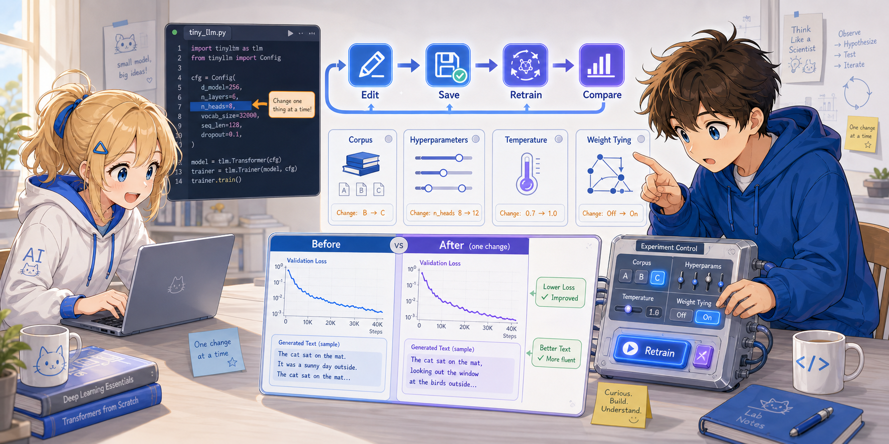

# Step 4: Modifying the Code



By now, you've gained a sense of how the Transformer works. Let's modify the code and run some experiments.

> **The working style changes from here on.**
> Through Steps 2-3 the flow was to enter interactive mode with `uv run --with torch python -i tiny_llm.py` and observe the trained model on the spot.
> In Step 4, the cycle is **edit `tiny_llm.py` directly in your editor → save → retrain with `uv run --with torch tiny_llm.py` → compare outputs** (no interactive mode).
> If you revert your changes before moving on to the next section after trying each one, it becomes easier to see the effect of one element at a time.

---

## 4.1 Changing the Corpus

Let's try changing the corpus in the `if __name__ == "__main__":` block of `tiny_llm.py`:

```python
# Original corpus
corpus = (
    "the cat sat on the mat . the dog sat on the log . "
    "the cat saw the dog . the dog saw the cat . "
    "the cat sat on the log . the dog sat on the mat ."
)
```

For example, let's add a new pattern:

```python
corpus = (
    "the cat sat on the mat . the dog sat on the log . "
    "the cat saw the dog . the dog saw the cat . "
    "the cat sat on the log . the dog sat on the mat . "
    "the bird sat on the log . the bird saw the cat ."
)
```

Run it and check whether "bird" is learned correctly:

```bash
uv run --with torch tiny_llm.py
```

> **Note**: Adding a new word changes the vocabulary size (10 → 11).
> The code itself auto-detects the vocabulary size, so it will work as-is.

---

## 4.2 Changing Hyperparameters

Change the hyperparameters at the top of `tiny_llm.py` and observe how the training results change.
**Writing your "prediction" first, then running it → lining it up with the measured value** raises the density of what you learn.

| Setting | Predicted final loss at 200 epochs | Measured |
|---|---|---|
| Default (N_HEADS=4, N_LAYERS=2, D_MODEL=64, LR=0.001) | Around 0.1 | ? |
| N_HEADS=1 | Slightly higher (0.2-0.5)? | ? |
| N_LAYERS=1 | Close to default? | ? |
| D_MODEL=16, D_FF=32 | Bottoms out due to insufficient expressivity? | ? |
| LR=0.01 | Fast but unstable? | ? |
| LR=0.0001 | Too slow to drop all the way? | ? |
| EPOCHS=50 | Undertrained, stops at a high value? | ? |

The change point for each setting is:

```python
N_HEADS = 1     # Just 1 head (no multi-head)
N_LAYERS = 1    # Just 1 layer
D_MODEL = 16    # Shrink from 64 → 16, also set D_FF = 32
LR = 0.01       # 10× larger
LR = 0.0001     # 1/10
EPOCHS = 50     # Too few
EPOCHS = 1000   # Too many (overfitting)
```

> **Tip**: Change just one thing, run once → record the value → revert to default and go to the next.
> Repeating this lets you see the effect of one element. If you change multiple things at once, you won't know what mattered.

---

## 4.3 Changing the Generation Method

### Temperature Sampling

The `generate()` function picks the next word with `argmax` (always the highest score).
Let's change this to probabilistic sampling:

```python
def generate(model, prompt, vocab, id2word, max_tokens=20, temperature=1.0):
    tokens = tokenize(prompt, vocab)

    with torch.no_grad():
        for _ in range(max_tokens):
            context = tokens[-SEQ_LEN:]
            x = torch.tensor([context])
            logits = model.forward(x)
            next_logit = logits[0, -1, :] / temperature    # ← Divide by temperature

            probs = torch.softmax(next_logit, dim=-1)      # Convert to probabilities
            next_id = torch.multinomial(probs, 1).item()    # Sample according to probabilities
            tokens.append(next_id)

    return " ".join(id2word[t] for t in tokens)
```

> **What `torch.multinomial(probs, 1)` is**: a function that samples 1 element from the probability distribution `probs`.
> For example, with `probs = [0.7, 0.2, 0.1]` it returns 0, 1, or 2 with probabilities 70% / 20% / 10%.
> With `argmax`, only 0 would come out every time, but using `multinomial` lets other candidates be selected according to the distribution at that moment, so variability is introduced in the generation.

- `temperature = 0.1`: Nearly the same as argmax (picks the most confident word)
- `temperature = 1.0`: Samples faithfully from the model's probability distribution
- `temperature = 2.0`: More random (unexpected words become more likely)

> This corpus is very small, so the differences are hard to see,
> but in real LLMs, temperature significantly affects the diversity of generated text.

---

## 4.4 Removing Weight Tying

At the end of the forward pass in `tiny_llm.py`, `tok_emb` is reused for the output projection:

```python
logits = x @ self.tok_emb.T    # Weight Tying: reuse the Embedding
```

Let's change this to an independent weight matrix. Add a new `out_proj` right after the `--- Embeddings ---` section in `TinyTransformer.__init__`:

```python
# --- Embeddings ---
self.tok_emb = param(vocab_size, D_MODEL)
self.pos_emb = param(SEQ_LEN, D_MODEL)
self.out_proj = param(D_MODEL, vocab_size)   # ← added (64, 10)
```

Change the end of `forward` to use `out_proj`:

```python
logits = x @ self.out_proj     # ← Drop Weight Tying and use an independent output projection
```

Finally, include `out_proj` in the trainable parameters via `parameters()`:

```python
def parameters(self):
    params = [self.tok_emb, self.pos_emb, self.out_proj,   # ← add out_proj
              self.ln_f_g, self.ln_f_b]
    for layer in self.layers:
        params.extend(layer.values())
    return params
```

Run it and compare:

- How much the parameter count (the `sum(p.numel() for p in model.parameters())` you saw in 3.1) increases
- How the loss convergence curve differs from the default

The increase works out to `D_MODEL * vocab_size = 64 * 10 = 640` parameters.

---

## 4.5 Further Challenges

Once you've gotten a feel for how the Transformer works through the experiments above, try these too:

- **Remove Layer Norm**: Can it learn with just residual connections?
- **Remove the causal mask**: What happens if you train with future words visible?
- **Remove residual connections**: What if you change `x = x + attention(x)` to `x = attention(x)`?
- **Larger corpus**: Add more short English sentences and expand the vocabulary to 30-50 words

Through these experiments, you should be able to feel firsthand
**why each element** of the Transformer is needed.

---

That completes one full lap of training and running a "plain language model."
Next, let's try instruction tuning and see how the "instruction-response" behavior, ChatGPT-style, is built.

Next: [Step 5: Try Instruction Tuning](05_instruction.md)
