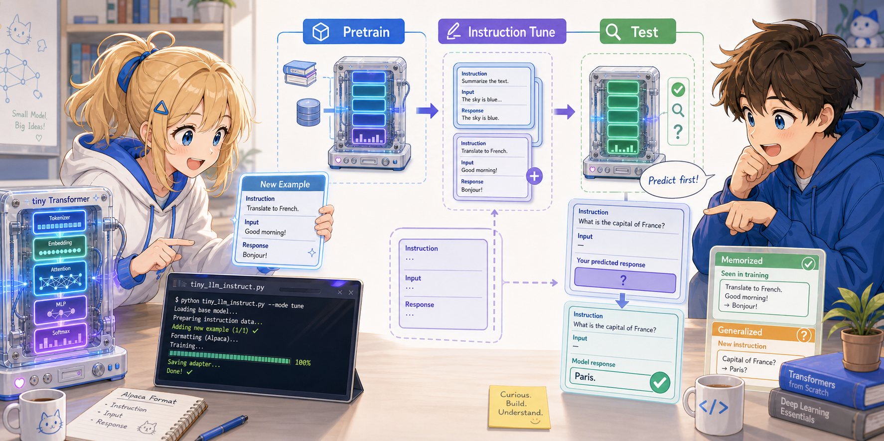

# Step 5: Try Instruction Tuning



Let's actually run the Alpaca-format Instruction Tuning we saw in Chapter 5 (main text) and experience it firsthand.
We'll observe how a pretrained model learns 4 instruction-response pairs and acquires "respond to an instruction" behavior.
However, we'll also see with our own eyes that the result is "rote memorization" and that there is no generalization like a real LLM.

> Starting from Step 5, the code file we work with changes. We run `tiny_llm_instruct.py` instead of `tiny_llm.py`
> (it's a separate file that imports `tiny_llm.py` and adds the instruction-tuning logic on top).

---

## 5.1 Run It

```bash
uv run --with torch tiny_llm_instruct.py
```

Three Stages run in sequence.

```
--- Stage 1: Pretraining ---        ← Regular language model training (200 epochs)
epoch   20  loss=...
...
epoch  200  loss=...

--- Stage 2: Instruction tuning --- ← Fine-tune with Response masking (300 epochs)
epoch   30  loss=...
...
epoch  300  loss=...

--- Stage 3: Responding ---         ← Response generation after training
### Instruction: who sat on the mat
### Response: (will be checked in 5.2 — don't look yet)

### Instruction: who saw the dog
### Response: (will be checked in 5.2 — don't look yet)

### Instruction: who sat on the log
### Response: (will be checked in 5.2 — don't look yet)
```

Confirm that the loss is clearly dropping in both Stage 1 and Stage 2.
The Stage 1 and Stage 2 losses use different loss functions (all positions / response positions only), so comparing the absolute values is meaningless. Just check **whether each one is dropping all the way down**.

(For the actual responses in Stage 3, first predict them in 5.2, then check against the answer.)

---

## 5.2 Predict the Output Before Checking

Looking at the `examples` list in `tiny_llm_instruct.py`, the training data is just these 4:

```python
examples = [
    ("who sat on the mat", "", "the cat"),
    ("who sat on the log", "", "the dog"),
    ("who saw the dog",    "", "the cat"),
    ("who saw the cat",    "", "the dog"),
]
```

In Stage 3, the model produces responses for 3 instructions. **Predict them yourself before running**, then compare against the output.

| Instruction | Your prediction | Actual output |
|---|---|---|
| `who sat on the mat` | ? | ? |
| `who saw the dog` | ? | ? |
| `who sat on the log` | ? | ? |

Since the training has fully memorized them, all 3 should return the responses exactly as in the training data.

---

## 5.3 Add a New Instruction Example

Let's add one more example to the `examples` list in `tiny_llm_instruct.py`:

```python
examples = [
    ("who sat on the mat", "", "the cat"),
    ("who sat on the log", "", "the dog"),
    ("who saw the dog",    "", "the cat"),
    ("who saw the cat",    "", "the dog"),
    ("who saw the mat",    "", "the dog"),   # ← added
]
```

Add a matching one to the Stage 3 test instructions:

```python
for ins in [
    "who sat on the mat",
    "who saw the dog",
    "who sat on the log",
    "who saw the mat",    # ← added
]:
```

Re-run:

```bash
uv run --with torch tiny_llm_instruct.py
```

If the 5th example is also memorized and `who saw the mat` returns `the dog`, you've succeeded.
You've confirmed that adding just 1 example is enough for the model to learn a new instruction-response pattern.

> As mentioned in Step 1.4, if you put **words not in the corpus** into the added instruction or response, you'll get a `KeyError`.
> Combine words within the existing vocabulary (`the`, `cat`, `sat`, `on`, `mat`, `.`, `dog`, `log`, `saw`, `who`).

---

## 5.4 Try OOD Instructions — See the Limits of Memorization

Let's try instructions not in the training data and see how the model behaves.

**Revert** the line you added in 5.3 so `examples` goes back to the original 4 lines, and only change the Stage 3 test instructions:

```python
for ins in [
    "who sat on the cat",    # ← instruction not in training (vocabulary is all known)
    "who saw the log",       # ← instruction not in training
    "who sat on the dog",    # ← instruction not in training
]:
```

Re-run and observe what responses come out. Common patterns:

- **Parrots** a response from an existing training example (e.g. they all become `the cat`)
- Strongly pulled toward the response of the most recently trained example
- A meaningless word sequence comes out

Since it has only learned 4 training examples, it **cannot meaningfully generalize** to unknown instructions. This is a limit of tiny-LLM's size and training amount, and it's the moment when you can **feel firsthand the message that "this is a rote-memorization model."**

---

## 5.5 Reduce the Instruction Tuning Epoch Count

Finally, let's observe "how much rote memorization is needed before it can respond."

Change the line in the `if __name__ == "__main__":` block where Stage 2 calls `train_instruct`:

```python
# --- Stage 2: Instruction tuning ---
print("\n--- Stage 2: Instruction tuning ---")
examples = [...]
train_instruct(model, examples, vocab, epochs=30)   # ← change to 30, 50, 100, etc.
```

| epochs | Expected behavior |
|---|---|
| 300 (original) | All 3 examples respond correctly (memorization complete) |
| 100 | Mostly correct, but occasionally breaks down |
| 50 | Only about half are remembered |
| 10 | Almost no learning has happened; output breaks down |

With low epoch counts, you can observe the intermediate state of "the format is produced but the response content is off."
Watching the loss convergence curve as well, get a feel for how much compute instruction tuning takes to complete.

---

## 5.6 (Optional) Design a Different Task with the Same Vocabulary

An exercise in coming up with your own `(instruction, response)` pairs combining only the existing vocabulary (`the cat sat on mat . dog log saw who`).

Example:

```python
examples = [
    ("what did the cat see", "", "the dog"),
    ("what did the dog see", "", "the cat"),
    ("where did the cat sit", "", "on the mat"),
    ("where did the dog sit", "", "on the log"),
]
```

However, the above example contains the previously-unseen words `what`, `did`, `where`, so as-is it will produce a `KeyError`. To get this through, you'll need to choose between either adding "`what did where`" to the end of the corpus as dummy occurrences to register them in the vocabulary, or composing the instructions only from words within the vocabulary.

> Once you adopt the perspective of **"designing the training data yourself"**, you can feel for yourself what people mean in real instruction tuning when they say
> "the quality and diversity of the dataset determines the result."

If you have time, build your own examples list, train, and see how much can be rote-memorized.

---

## Summary — Reviewing the Entire Tutorial

Across the 5 Steps, you experienced the following **by hand**:

1. **Step 1**: Confirmed that `uv run` one-shot runs training and generation through to completion
2. **Step 2**: Observed the sliding-window structure of tokenization and training data as tensors
3. **Step 3**: Pulled out Embeddings and Attention weights and confirmed the model operates on "numerical tensors"
4. **Step 4**: Changed hyperparameters and structure (Weight Tying, Temperature) and measured the impact on loss and generation
5. **Step 5**: Ran the 3 stages pretrain → instruction tuning → response and saw that Response masking creates the "follow an instruction" behavior. At the same time, felt firsthand the "limits of rote memorization"

The result was rote memorization, but the takeaway of this tutorial is that you assembled the procedure itself ("delimit with format + loss only on the response") with your own hands.

This is the end of the tiny-LLM tutorial.
Going back to the main documentation and re-reading each chapter, you should be able to understand the math and architecture behind the behavior you ran here at a deeper level.

- [Documentation top](../01_data.md)
- [Chapter 5 main text (Instruction Tuning)](../05_instruction_tuning.md)
