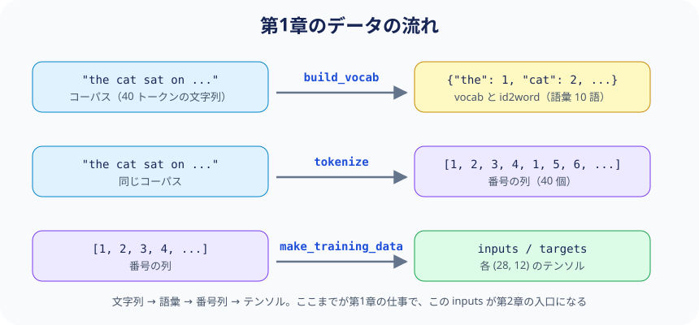

# 第1章: データの準備 — 文章をモデルが扱える形にする


LLM が扱うのは数値だけです。
「英語の文章」を「数値の列」に変換し、さらに「入力と正解のペア」を作る——
この章ではその全過程を、具体例とともに追いかけます。

---

## 1.1 コーパス（学習テキスト）

まず出発点となるテキストを用意します。

```python
corpus = (
    "the cat sat on the mat . the dog sat on the log . "
    "the cat saw the dog . the dog saw the cat . "
    "the cat sat on the log . the dog sat on the mat ."
)
```

この 40 単語（`the` が 12 回、`cat` が 4 回…と、同じ単語も重複して数えます）のかたまりが
**コーパス（corpus）** — モデル（これから作る Transformer 本体。第2章で組み立てます）に
学習させる文章データのまとまりです。
実用 LLM では Web 規模の膨大なテキストを指しますが、たった 40 単語でも
Transformer の構造を学ぶには十分です。

---

## 1.2 `build_vocab` — 単語に番号を振る

```python
def build_vocab(text):
    words = text.split()
    vocab = {"<pad>": 0}
    for w in words:
        if w not in vocab:
            vocab[w] = len(vocab)
    return vocab, {i: w for w, i in vocab.items()}
```

>
> **Python Tips: 辞書内包表記 `{i: w for w, i in ...}`**
>
> `{i: w for w, i in vocab.items()}` は **辞書内包表記（dict comprehension）** です。
> for ループで辞書を作る短縮記法です：
> ```python
> # 以下の2つは同じ結果
> id2word = {}
> for w, i in vocab.items():
>     id2word[i] = w
>
> id2word = {i: w for w, i in vocab.items()}  # 1行で書ける
> ```
> `vocab.items()` は `("the", 1), ("cat", 2), ...` のようなペアを返します。
> `for w, i in ...` でそのペアを `w="the", i=1` のように分解しています。

### `build_vocab` が何をしているか

1. テキストを空白で分割して単語のリストにする
2. 出現順に、重複なく番号を振る（`<pad>` は予約語で 0 番）
3. 「単語→番号」の辞書と「番号→単語」の逆引き辞書を返す

`<pad>`（padding token）は、長さの足りない系列を埋めるための詰め物用のトークンです。
詳しくは §1.4 で説明します。

### 具体例

```
引数:  "the cat sat on the mat . the dog sat on the log ..."

戻り値 vocab:
  {"<pad>": 0, "the": 1, "cat": 2, "sat": 3, "on": 4,
   "mat": 5, ".": 6, "dog": 7, "log": 8, "saw": 9}

戻り値 id2word:
  {0: "<pad>", 1: "the", 2: "cat", 3: "sat", 4: "on",
   5: "mat", 6: ".", 7: "dog", 8: "log", 9: "saw"}
```

この辞書のエントリ数が **語彙数（vocab_size）** で、ここでは **10** です。

> **数値の読み方:** 本プロジェクトでは、すべての主要な数値が異なる値に
> なるよう設計しています。テンソルの形状に現れる数値を見れば、
> それが何を意味しているか即座にわかります：
>
> （**テンソル** とは `(28, 12, 64)` のような多次元配列のことです。
> 数学的には厳密な定義がありますが、tiny-LLM を読むうえでは
> 「テンソル = 多次元配列」と思っておけば十分です。§1.4 で改めて触れます。）
>
> | 数値 | 意味 |
> |------|------|
> | **1** | バッチの個数（全28サンプルを1バッチで処理 = フルバッチ） |
> | **2** | Transformer の層数（N_LAYERS） |
> | **4** | Attention ヘッド数（N_HEADS） |
> | **10** | 語彙数（vocab_size） ※第5章では Alpaca マーカー追加で **15** に拡張 |
> | **12** | シーケンス長（SEQ_LEN） |
> | **16** | ヘッドの次元数（head_dim = 64 ÷ 4） |
> | **28** | 訓練サンプル数（コーパス 40 トークン − SEQ_LEN 12 = 28、§1.4 のスライドウィンドウで生成）。これがそのままバッチサイズになる |
> | **64** | 埋め込み次元（D_MODEL） |
> | **128** | FFN の隠れ層次元（D_FF） |
>
> 例えば、変数 `x` の形状が次のようになっていれば、数字だけで中身が読み取れます：
>
> ```python
> x.shape  # torch.Size([28, 12, 64])
>          #             │   │   └─ 64: D_MODEL（1トークンあたりの数値の個数）
>          #             │   └───── 12: SEQ_LEN（トークン数）
>          #             └───────── 28: サンプル数（= バッチサイズ）
> ```

> **実際の LLM との違い:** GPT などは BPE（Byte Pair Encoding）で単語をさらに
> サブワードに分割します。ここでは「トークン＝単語」と簡略化しています。

---

## 1.3 `tokenize` — 文章を数値の列に変換する

```python
def tokenize(text, vocab):
    return [vocab[w] for w in text.split()]
```

>
> **Python Tips: リスト内包表記 `[... for ... in ...]`**
>
> `[vocab[w] for w in text.split()]` は **リスト内包表記（list comprehension）** です。
> for ループでリストを作る短縮記法です：
> ```python
> # 以下の2つは同じ結果
> result = []
> for w in text.split():
>     result.append(vocab[w])
>
> result = [vocab[w] for w in text.split()]  # 1行で書ける
> ```

### `tokenize` が何をしているか

文章を空白で分割し、各単語を `vocab` で番号に置き換えます。

### 具体例

```
引数:  text  = "the cat sat on the mat"
       vocab = {"<pad>": 0, "the": 1, "cat": 2, "sat": 3, "on": 4, "mat": 5, ...}

戻り値: [1, 2, 3, 4, 1, 5]
```

```
"the"  →  1
"cat"  →  2
"sat"  →  3
"on"   →  4
"the"  →  1   ← 同じ単語は同じ番号
"mat"  →  5
```

この数値のリスト（**トークン列**）が、以降すべての処理の基本単位になります。

---


## 1.4 `make_training_data` — 「入力」と「正解」のペアを作る

ここが最も重要です。LLM の学習は本質的に **「直前の単語列から、次の単語を予測する」** タスクです。

```python
def make_training_data(text, vocab):
    tokens = tokenize(text, vocab)
    inputs, targets = [], []
    for i in range(len(tokens) - SEQ_LEN):
        inputs.append(tokens[i : i + SEQ_LEN])
        targets.append(tokens[i + 1 : i + SEQ_LEN + 1])
    return torch.tensor(inputs), torch.tensor(targets)
```

### なぜ `SEQ_LEN` で切り出すのか（= コンテキスト長）

Transformer は、1回の計算で処理できるトークン数に上限があります。
この上限が **コンテキスト長（context length / context window）** で、
本プロジェクトでは `SEQ_LEN = 12` がそれに相当します。

たとえばコーパスの先頭を入力にすると、こう切れます：

```
1回で渡せる（12トークン）:  the cat sat on the mat . the dog sat on the
入らない:                                                              log . ...
```

`the cat sat on the mat . the dog sat on the log .` のように 13 トークン以上を
まとめて渡すことはできません。`log` から先は、窓を 1 つずらした次のサンプルが担当します。

そのため学習時は、コーパスを「長さ12の窓」に切り出してモデルへ渡しています。
生成時も同様で、`generate()` 内では常に直近 `SEQ_LEN` トークンだけを文脈として使います。
つまり、トークン列が `SEQ_LEN` を超えて長くなると、より古いトークンは文脈から外れます。

### パディング（padding）との関係

大規模な事前学習では、通常はテキストを句点で厳密に区切らず、
トークン列を連結して固定長チャンク（`SEQ_LEN`）で切り出して学習します。
この運用では長さが最初から揃うため、padding は基本的に不要です。

一方で、SFT など可変長サンプルを同一バッチに詰める学習では、
短い系列を `<pad>` で埋める（padding）ことがあります。
本コードは固定長 `SEQ_LEN` で学習サンプルを作るため、
訓練時には実質的に padding 処理を使いません（`<pad>` は予約トークンとしてのみ定義）。

>
> **Python Tips: スライス `tokens[i : i + SEQ_LEN]`**
>
> リストのスライスは `リスト[開始:終了]` で、開始から終了の **手前まで** を取り出します：
> ```python
> tokens = [1, 2, 3, 4, 5, 6, 7, 8]
> tokens[0:3]   # → [1, 2, 3]      位置0, 1, 2（3は含まない）
> tokens[2:5]   # → [3, 4, 5]      位置2, 3, 4
> tokens[1:4+1] # → [2, 3, 4, 5]   i+1 から i+SEQ_LEN+1 の手前まで
> ```

>
> **Python Tips: `torch.tensor()` — リストをテンソルに変換**
>
> `torch.tensor([[1,2,3], [4,5,6]])` は Python のリストを PyTorch のテンソルに変換します。
> テンソルは「多次元配列」で、GPU演算や自動微分に対応しています：
> ```python
> import torch
> x = torch.tensor([[1, 2], [3, 4]])
> x.shape  # → torch.Size([2, 2])  ← 2行×2列
> ```
>
> なぜリストのままではいけないのか。PyTorch のような LLM 向けのライブラリは、
> **計算をテンソル単位でまとめて行う** 前提で設計されているからです。
> 28 サンプル × 12 トークン分の計算を Python の for ループで 1 つずつ回す代わりに、
> テンソルを 1 回渡すだけで、内部の最適化された C++ / CUDA コードが処理します。
> NVIDIA の GPU ならこれを数千のコアで並列実行でき、テンソルを GPU に移すだけで
> 同じコードがそのまま GPU 上で動きます
> （tiny-LLM は CPU でも数秒で終わる規模なので、GPU は使っていません）。

### `make_training_data` が何をしているか

1. コーパス全体をトークン列に変換する
2. そのトークン列の先頭から、長さ `SEQ_LEN`（=12）のウィンドウを 1 トークンずつずらしていく
3. 各ウィンドウで **入力（input）** と **正解（target）** のペアを作る

### 具体例（SEQ_LEN=12 の場合）

コーパスのトークン列（全40トークン）:

```
位置:  0   1   2   3   4   5   6   7   8   9  10  11  12  13 ...
単語: the cat sat  on the mat  .  the dog sat  on the log  .  ...
番号:  1   2   3   4   1   5   6   1   7   3   4   1   8   6 ...
```

**スライドウィンドウの仕組み:**

```
i=0:
  input  = tokens[ 0:12] = [1,2,3,4,1,5,6,1,7,3,4,1]
  target = tokens[ 1:13] = [2,3,4,1,5,6,1,7,3,4,1,8]
                              ↑ input の各位置の「次の単語」が target

i=1:
  input  = tokens[ 1:13] = [2,3,4,1,5,6,1,7,3,4,1,8]
  target = tokens[ 2:14] = [3,4,1,5,6,1,7,3,4,1,8,6]

i=2:
  input  = tokens[ 2:14] = [3,4,1,5,6,1,7,3,4,1,8,6]
  target = tokens[ 3:15] = [4,1,5,6,1,7,3,4,1,8,6,1]

  ...（i=27 まで繰り返して、合計 28 サンプル）
```

>
> **スライド幅（ストライド）について**
>
> 本コードではウィンドウを **1単語ずつ** スライドしています（i=0, 1, 2, ...）。
> しかし、スライド幅は本来自由に設定できます：
>
> ```
> ストライド 1:  i=0, 1, 2, 3, ...  → サンプル数 多い、重複 多い
> ストライド 4:  i=0, 4, 8, 12, ... → サンプル数 少ない、重複 少ない
> ストライド 12: i=0, 12, 24, ...   → 重複なし（ウィンドウが隣接）
> ```
>
> - **ストライド 1** はデータを最大限に活用できますが、隣り合うサンプルの
>   大部分が重複します
> - **大きなストライド** は重複が減り計算が速くなりますが、サンプル数が減ります
> - 大規模 LLM の訓練では、コーパスが十分に大きいため
>   ストライドを大きくしても問題になりません
>
> 本プロジェクトではコーパスが小さいので、ストライド 1 で最大限のサンプルを
> 生成しています。

### target は input を1つずらしたもの

これを図にすると、本質が見えます：

```
input:   the  cat  sat  on   the  mat   .   the  ...
target:  cat  sat  on   the  mat   .   the  dog  ...
         ↑    ↑    ↑    ↑    ↑    ↑    ↑    ↑
         各位置で「次に来るべき単語」を予測させる
```

位置 0 では「the の次は cat」、位置 1 では「cat の次は sat」…
**すべての位置で同時に「次の単語」を予測する** のがポイントです。

### 戻り値の形状

```
inputs:  torch.Tensor, shape = (28, 12)    ← 28サンプル × 12トークン
targets: torch.Tensor, shape = (28, 12)    ← 対応する正解
```

> **バッチとエポック**
>
> この `(28, 12)` は「28サンプル全部（12 単語の並びが 28 本）を 1 つの塊にまとめた形」です。
> ここで用語を 2 つ整理しておきます。
>
> - **バッチ**: 一度にまとめてモデル（= Transformer 本体）へ渡すサンプルの束。
>   ここでは **この 28 本の塊まるごと** が 1 バッチ。
>   コードもこの単位で動くように組まれていて、28 本を 1 本ずつループするのではなく、
>   塊のまま forward → loss → backward → update を 1 回ずつ実行する
> - **エポック**: 訓練データ全体を 1 周すること。
>   訓練データが 2 バッチに分かれているなら、2 バッチ分を処理し終えた時点で 1 エポック。
>   つまり 1 周のあいだに何回パラメータを更新するかは、バッチをいくつに分けたかで決まる
>
> 本プロジェクトは 28 サンプルを一度に渡すので、
> **バッチサイズ 28 / バッチの個数 1 / 1エポックあたりの更新 1 回** です。
> 機械学習の用語でいう **フルバッチ勾配降下法** にあたります
> （第3章の `EPOCHS = 200` は、この 1 周を 200 回繰り返すという意味です）。
>
> 大規模なコーパスでは、全サンプルを一度にメモリへ載せられないため、
> 数十サンプルずつの **ミニバッチ** に分割します。
> その分割数がそのまま 1 エポックあたりの更新回数になり、数万回に達することもあります。
> どの場合も、各バッチの中で「次の単語を予測する」という学習の核は同じです。

---

## 1.5 データの流れ — 全体像



ここまでで、モデルに渡す準備が整いました。

**次の章（第2章）** では、この `inputs` テンソルが Transformer の中で
どのように処理されるかを見ていきます。

---

## まとめ

| 関数 | 入力 | 出力 | 役割 |
|------|------|------|------|
| `build_vocab(text)` | 文字列 | `vocab` (dict), `id2word` (dict) | 単語に番号を振る |
| `tokenize(text, vocab)` | 文字列, vocab | `[int, ...]` (list) | 文章を番号列に変換 |
| `make_training_data(text, vocab)` | 文字列, vocab | `inputs` (28,12), `targets` (28,12) | 学習用ペアを作成 |
