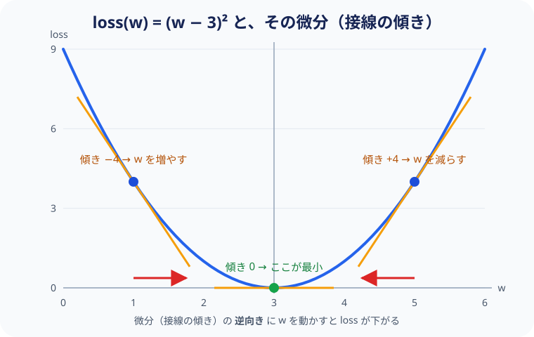
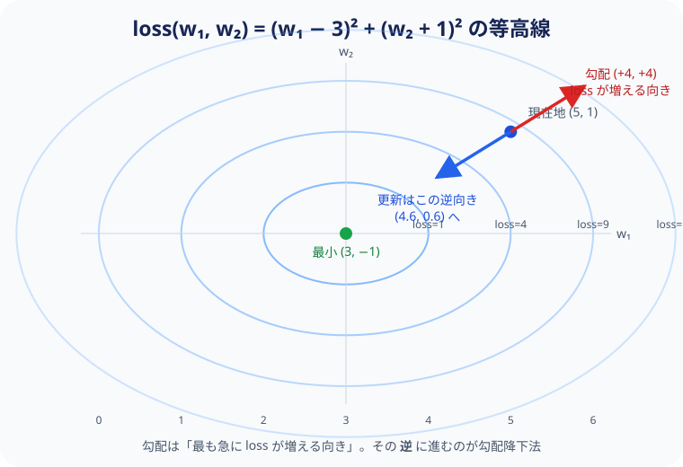

# 補足: 勾配（Gradient）の数学的な直感


第3章で「勾配」が登場しました。
ここでは、具体的な数値を使って勾配の意味を数学的に説明します。

---

## 1変数の場合 — 微分

まず最も単純なケースから始めます。

パラメータが1つだけ（$w$）で、損失が以下の関数だとします：

$$\text{loss}(w) = (w - 3)^2$$

この関数は $w = 3$ のとき最小値 0 をとります。

**微分** は「$w$ を少し動かしたとき、loss がどれだけ変わるか」の比率です：

$$\frac{d\thinspace \text{loss}}{d\thinspace w} = 2(w - 3)$$

具体的な値で見てみましょう：

```
w = 5.0 のとき:
  loss = (5-3)² = 4.0
  微分 = 2(5-3) = +4.0    ← 正：w を減らせば loss が下がる

w = 1.0 のとき:
  loss = (1-3)² = 4.0
  微分 = 2(1-3) = -4.0    ← 負：w を増やせば loss が下がる

w = 3.0 のとき:
  loss = (3-3)² = 0.0
  微分 = 2(3-3) = 0.0     ← ゼロ：最適地点に到達
```

**更新則** は、微分の **逆方向** に $w$ を動かします：

$$w \leftarrow w - \eta \cdot \frac{d\thinspace \text{loss}}{d\thinspace w}$$

$\eta = 0.1$（学習率）として：

```
ステップ 1:  w = 5.0  →  5.0 - 0.1 × 4.0  = 4.6
ステップ 2:  w = 4.6  →  4.6 - 0.1 × 3.2  = 4.28
ステップ 3:  w = 4.28 →  4.28 - 0.1 × 2.56 = 4.024
  ...徐々に w = 3.0 に近づいていく
```



図で見ると分かりやすくなります。放物線の各点に接線を引くと、その傾きが微分です。
傾きが正なら左へ、負なら右へ——つまり **傾きの逆向き** へ進めば、必ず谷底に近づきます。

これが **勾配降下法（Gradient Descent）** の本質です。

---

## 2変数の場合 — 偏微分

パラメータが2つ（$w_1, w_2$）になると、**偏微分** を使います：

$$\text{loss}(w_1, w_2) = (w_1 - 3)^2 + (w_2 + 1)^2$$

最小値は $w_1 = 3, w_2 = -1$ のとき loss = 0 です。

偏微分は「他のパラメータを固定して、1つだけ動かしたときの変化率」：

$$\frac{\partial\thinspace \text{loss}}{\partial\thinspace w_1} = 2(w_1 - 3), \quad \frac{\partial\thinspace \text{loss}}{\partial\thinspace w_2} = 2(w_2 + 1)$$

この2つをまとめたベクトルが **勾配（gradient）** です：

$$\nabla \text{loss} = \left(\frac{\partial\thinspace \text{loss}}{\partial\thinspace w_1},\thickspace \frac{\partial\thinspace \text{loss}}{\partial\thinspace w_2}\right)$$

更新は各パラメータを **同時に** 行います：

```
w1 = 5.0, w2 = 1.0 のとき:
  ∂loss/∂w1 = 2(5-3)  = +4.0
  ∂loss/∂w2 = 2(1+1)  = +4.0

更新:
  w1 = 5.0 - 0.1 × 4.0 = 4.6
  w2 = 1.0 - 0.1 × 4.0 = 0.6
```



2 変数になると、損失は「すり鉢状の地形」になります。
同じ高さの点を結んだ線（等高線）を描くと、中心の (3, −1) が谷底です。
勾配 $\nabla\text{loss}$ は **最も急に loss が増える向き** を指すベクトルなので、
その逆向きへ一歩進むことが更新にあたります。

2変数でも1変数と同じことを、**各パラメータについて独立に** やるだけです。

---


## 68,000 変数の場合 — tiny-LLM

tiny-LLM のパラメータ数は約 68,000 です。
しかしやっていることは2変数の場合とまったく同じです：

$$w_i \leftarrow w_i - \eta \cdot \frac{\partial\thinspace \text{loss}}{\partial\thinspace w_i} \quad (i = 1, 2, \ldots, 68000)$$

68,000 個の偏微分を1つ1つ手で求めるのは不可能です。
しかし **連鎖律（chain rule）** を使えば、機械的に計算できます。

---

## 連鎖律（Chain Rule）

合成関数 $y = f(g(x))$ の微分は：

$$\frac{dy}{dx} = \frac{dy}{dg} \cdot \frac{dg}{dx}$$

具体例で見ましょう。$g(x) = 2x + 1$、$f(g) = g^2$ のとき：

```
x = 3 のとき:
  g = 2×3 + 1 = 7
  y = 7² = 49

  dg/dx = 2
  dy/dg = 2g = 14
  dy/dx = 14 × 2 = 28     ← 掛け算するだけ
```

Transformer は多数の関数の合成です：

```
x → Embedding → Attention → FFN → ... → logits → loss
```

連鎖律を繰り返し適用すると：

$$\frac{\partial\thinspace \text{loss}}{\partial\thinspace W_q} = \frac{\partial\thinspace \text{loss}}{\partial\thinspace \text{logits}} \cdot \frac{\partial\thinspace \text{logits}}{\partial\thinspace \text{attn}} \cdot \frac{\partial\thinspace \text{attn}}{\partial\thinspace W_q}$$

各層の **局所的な微分を掛け合わせるだけ** で、入力に近いパラメータの勾配も求まります。

これが **誤差逆伝播（Backpropagation）** です。
PyTorch の `loss.backward()` は、この連鎖律の計算を自動的に行います。

---

## まとめ

| 概念 | 意味 |
|------|------|
| 微分 $\frac{d\thinspace \text{loss}}{dw}$ | $w$ を少し動かしたとき loss がどれだけ変わるか |
| 偏微分 $\frac{\partial\thinspace \text{loss}}{\partial w_i}$ | 他を固定して $w_i$ だけ動かしたときの変化率 |
| 勾配 $\nabla\text{loss}$ | 全パラメータの偏微分をまとめたベクトル |
| 連鎖律 | 合成関数の微分を、各段の微分の積で求める |
| 勾配降下法 | 勾配の逆方向にパラメータを動かして loss を下げる |
| `loss.backward()` | 連鎖律を自動適用して全パラメータの勾配を計算する |

重要なのは、変数が 1 個でも 68,000 個でも **原理は同じ** だということです。
「各パラメータを、loss が下がる方向に少しだけ動かす」——これを繰り返すだけです。
