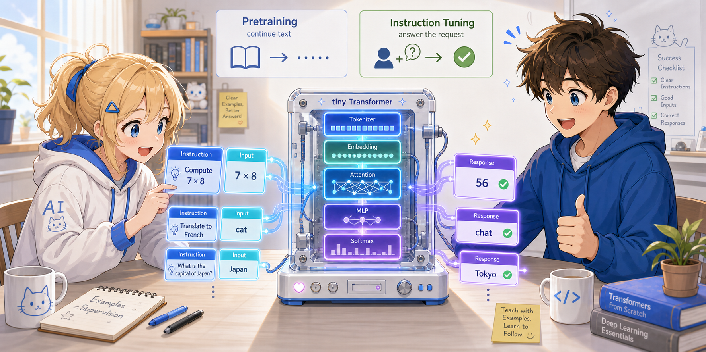

# 第5章: インストラクションチューニング — 指示に従う LLM の作り方



第4章までで、Transformer は **「次の単語を予測する」** モデルとして完成しました。
コーパスを丸暗記したような出力は出せますが、
ChatGPT のように「ユーザーの質問に答える」挙動はまだありません。

この章では、もう一段階の訓練を加えることで、
モデルを **「指示に従う」** ように仕立てる仕組みを見ていきます。
Stanford の Alpaca プロジェクトが標準化した形式を使います。

> この章のコードは新しいファイル `tiny_llm_instruct.py` にあります。
> 第4章までの `tiny_llm.py` はそのまま import して再利用します。

---

## 5.1 事前学習 vs インストラクションチューニング

現代の LLM は、ふつう **二段階の訓練** で作られます。

**段階1: 事前学習 (Pretraining)**

- 大量の自然言語コーパス（Web、書籍、論文…）で「次の単語の予測」を学ぶ
- 第3章までで見たやり方そのもの
- ここでモデルは **「言語」** を覚える
- 一度学習すれば、いろんなタスクに使える土台になる

**段階2: インストラクションチューニング (Instruction Tuning)**

- 事前学習済みモデルを、「指示 → 応答」の形式で **追加訓練** する
- ここでモデルは **「指示に従う」** ことを覚える
- 「翻訳して」「要約して」「○○について説明して」のような指示に応答できるようになる

```
[未訓練モデル]
        ↓ Pretraining (大量のコーパス)
[事前学習済みモデル: 言語を覚えた]
        ↓ Instruction Tuning (指示×応答ペア)
[Instruction-tuned モデル: 指示に従える]
```

仕組みとして注目すべきは：

> **モデルも Cross-Entropy Loss も第4章までと同じものを使います。**
> 変わるのは **訓練データの形** と **どの位置で loss を計算するか** だけ。

つまり、「次の単語の予測」という基本機構の応用で全部できてしまうのです。

> ### ⚠️ 最重要ポイント — 「事前学習済みモデル」は **文字通り同じ `model` オブジェクト**
>
> 上の図の 2 段階目「Instruction Tuning」では、**新しいモデルを作りません**。
> Stage 1 で訓練した `model` 変数を **そのまま** Stage 2 に渡し、続きから訓練します。
>
> ```python
> model = TinyTransformer(len(vocab))   # ← モデルを作るのはここ「1 回だけ」
> train(model, ...)                      # Stage 1: 重みを pretraining で更新
> train_instruct(model, ...)             # Stage 2: 同じ model を fine-tune (重みを引き継ぐ!)
> ```
>
> もし Stage 2 で `model = TinyTransformer(...)` を再実行してしまうと、Stage 1 で覚えた言語知識は **全部消えます**。4 例の指示データだけでは英語の語順すら学べないので、生成結果は完全にデタラメになります。
>
> **fine-tune (= 既存の重みを「追加調整」する) という言葉の意味はまさにこれ**。Stage 1 の重みは捨てずに上から塗り重ねる、それが instruction tuning の核心です。

---

## 5.2 Alpaca 形式

「指示 → 応答」をモデルに教えるには、**形式の決まったテンプレート** を使うのが標準です。
Stanford の Alpaca プロジェクトが提案したのが以下の形式です。

```
### Instruction: <指示>
### Input: <文脈や入力（必要に応じて）>
### Response: <期待される応答>
```

入力 (Input) が必要ないタスクでは、Input セクションを省略します。

**Input ありの例:**

```
### Instruction: 主語を答えて
### Input: The cat sat on the mat.
### Response: The cat
```

**Input なしの例:**

```
### Instruction: 7 * 8 を計算して
### Response: 56
```

### なぜ「形式」が必要なのか

形式の決まった区切りがあると、モデルは
**「ここまでが入力／ここから先が応答」** を学びやすくなります。

- 訓練中: モデルは `### Response:` の **直後** に「期待される応答」が来ることを学ぶ
- 推論時: `### Instruction: <質問> ### Response:` までを与えれば、続きを生成する

つまり `### Response:` というマーカーが、**応答開始の合図** として機能します。

---

## 5.3 トイデータセットを組み立てる

本プロジェクトの語彙は元々 10 単語しかありません。

```python
{"<pad>": 0, "the": 1, "cat": 2, "sat": 3, "on": 4,
 "mat": 5, ".": 6, "dog": 7, "log": 8, "saw": 9}
```

これに、Alpaca 形式のマーカーとタスク用の単語を足します。

| 追加トークン | 役割 |
|---|---|
| `###` | フォーマット区切りの記号 |
| `Instruction:` | 指示セクションの開始マーカー |
| `Input:` | 入力セクションの開始マーカー（今回のトイ例では未使用） |
| `Response:` | 応答セクションの開始マーカー |
| `who` | 「誰が…?」の質問語 |

これで語彙は計 **15 個** になります。

> **数値の読み方:** 第1章 §1.2 の「数値の読み方」表のとおり、本プロジェクトは主要な数値が他と被らないように設計されています。
> 第1〜4章では `vocab_size = 10` でしたが、第5章では Alpaca マーカー 4 個 + `who` を足して **`vocab_size = 15`** に拡張されます。
> **15 という値は他のどのパラメータ (2, 4, 10, 12, 16, 28, 64, 128) とも重複しない** ので、第5章以降にテンソル形状で 15 が出てきたら「語彙数だ」と即座に判別できます。
> 例えば `logits.shape = (4, 12, 15)` を見たら「4 サンプル × 12 トークン × 15 語彙のスコア」と読めます。

> **トークナイザの仕組み（おさらい）**
>
> 第1章で見たように、本プロジェクトのトークナイザは **空白で分割するだけ** です。
> なので `### Instruction:` は `###` と `Instruction:` の **2 トークン** に分かれます。
> (BPE 等のサブワードトークナイザを使うと `###` も `Instruction` もさらに細かい単位に分かれますが、処理の流れは同じです。)

### トイのインストラクション・データセット

たった 4 例だけのおもちゃデータセットを使います。

```python
examples = [
    ("who sat on the mat", "", "the cat"),
    ("who sat on the log", "", "the dog"),
    ("who saw the dog",    "", "the cat"),
    ("who saw the cat",    "", "the dog"),
]
```

各タプルは `(instruction, input, response)` の 3 つ組です。
今回は Input を使わないシンプルな例ばかりにしました。

これを Alpaca 形式の文字列に展開すると：

```
### Instruction: who sat on the mat ### Response: the cat
### Instruction: who sat on the log ### Response: the dog
### Instruction: who saw the dog ### Response: the cat
### Instruction: who saw the cat ### Response: the dog
```

`format_alpaca` 関数がこの整形をやります：

```python
def format_alpaca(instruction, input_text, response):
    if input_text:
        return (f"### Instruction: {instruction} "
                f"### Input: {input_text} "
                f"### Response: {response}").strip()
    return (f"### Instruction: {instruction} "
            f"### Response: {response}").strip()
```

---

## 5.4 Response マスキング — loss を「応答だけ」に集中させる

ここが本章の **最重要ポイント** です。

普通に Cross-Entropy Loss を全位置で計算すると、モデルは
**「指示テキストも予測する」** ことを学んでしまいます。
これは無駄であり、害もあります。

- 学習容量を「指示部分の言語パターン」に浪費する
- 訓練後にモデルが「指示文を生成してしまう」挙動になりかねない

私たちが欲しいのは：

> **「指示が来たら、その続きとして応答を生成する」**

それだけです。だから、loss は **応答トークンの位置だけ** で計算します。
残りの位置は **マスクで 0** にして、勾配計算に貢献させません。

### 図で理解する

1 例分のデータテンソルが、各位置でどう並ぶかを見ます。

- **`inp`**: モデルへの入力。順伝播でモデルが「見る」全トークン (position 0 から seq_len-1)
- **`tgt`**: 各位置で予測してほしい正解。`inp` を 1 つずらしたもの (position `i` での予測対象は `inp[i+1]`)
- **`mask`**: 各位置の loss を最終 loss に含めるかの 0/1 (`tgt` にかける)

```
position:  0    1    2    3    4    5    6    7    8    9    10   11
inp:       ###  Ins  who  sat  on   the  mat  ###  Res  the  cat  <pad>
tgt:       Ins  who  sat  on   the  mat  ###  Res  the  cat  <pad><pad>
mask:      0    0    0    0    0    0    0    0    1    1    1    0
```

ポイント：

- `tgt` 側で見て、 position 8 と 9 が **応答トークン** (`the`, `cat`)。 → mask=1 (loss を計算)
- position 10 (`tgt[10] = <pad>`) も **応答直後の停止の合図** として loss に含める。 → mask=1
  これが無いと、訓練でモデルは「`cat` の後で止まる」を学ばず、推論時に max_tokens まで何かを生成し続けてしまう
- それ以外の `tgt` 位置 — 指示文や `### Response:` マーカー、2 つ目以降の `<pad>` — は loss を計算しない。 → mask=0
- ここで重要な分離: **指示や `### Response:` マーカー自体は `inp` に存在し、モデルは見る (条件付け)**。
  ただし、それらを「予測対象」とはしない (mask=0)。

つまり instruction tuning の核は、**モデルに何を見せるか (`inp`) と、何を学習させるか (`mask` が選ぶ `tgt` の一部) を別に扱う** ことです。

上の `mask` 行はそのまま `torch.tensor([0, 0, 0, 0, 0, 0, 0, 0, 1, 1, 1, 0])` になります。
これを per-token loss に掛け算すれば、1 の位置だけが最終 loss に貢献します。

---

## 5.5 訓練コード

### `build_example` — 1 例から (input, target, mask) を作る

引数:

- `instruction`, `input_text`, `response`: Alpaca の 3 要素 (例: `"who sat on the mat"`, `""`, `"the cat"`)
- `vocab`: 第1章で作った word → ID マッピング
- `seq_len`: 出力テンソルの長さ。**モデルのコンテキストウィンドウサイズ** と同じ値を渡す (本プロジェクトでは `tiny_llm.py` で定義された `SEQ_LEN = 12`)。短い例は `<pad>` で埋め、長すぎる例は末尾を切り詰めて、すべての例を同じ長さに揃える役割

返り値: `inp`, `tgt`, `mask` (それぞれ長さ `seq_len` のリスト)

```python
def build_example(instruction, input_text, response, vocab, seq_len):
    pad = vocab["<pad>"]

    # "### Response:" までの prefix が何トークンあるか
    prefix_text = format_alpaca(instruction, input_text, "")
    P = len(tokenize(prefix_text, vocab))

    # 全文 ("### Instruction: ... ### Response: <response>")
    full_text = format_alpaca(instruction, input_text, response)
    full_ids = tokenize(full_text, vocab)
    F_len = len(full_ids)

    # 長さを seq_len + 1 に揃える（1 つ余分にあるのは shift のため）
    if F_len > seq_len + 1:
        full_ids = full_ids[:seq_len + 1]
        F_len = seq_len + 1
    full_ids = full_ids + [pad] * (seq_len + 1 - len(full_ids))

    inp = full_ids[:seq_len]         # 入力 (T)
    tgt = full_ids[1:seq_len + 1]    # ターゲット (T) — 1 つずらしたもの

    # マスク: 応答トークン + 応答直後の <pad> 1 つの位置で 1
    # 応答トークンは full_ids の index [P, F_len - 1] にあり、
    # さらに直後の <pad> も「停止の合図」として学習させたいので含める
    # ターゲット indexing では [P - 1, F_len - 1]
    mask = [1 if (P - 1) <= i <= (F_len - 1) else 0 for i in range(seq_len)]

    return inp, tgt, mask
```

#### 引数と返り値の例

1 つ目の例 `("who sat on the mat", "", "the cat")` で呼ぶと、こうなります。

```python
inp, tgt, mask = build_example(
    instruction="who sat on the mat",
    input_text="",
    response="the cat",
    vocab=vocab,      # vocab_size = 15 ( ### → 10, Instruction: → 11, who → 14 など)
    seq_len=12,
)

# 返り値 (3 つともリスト長 = 12):
inp  == [10, 11, 14,  3,  4,  1,  5, 10, 13,  1,  2,  0]
tgt  == [11, 14,  3,  4,  1,  5, 10, 13,  1,  2,  0,  0]
mask == [ 0,  0,  0,  0,  0,  0,  0,  0,  1,  1,  1,  0]

# 単語に戻すと:
# inp : ###  Instruction:  who  sat  on  the  mat  ###  Response:  the  cat   <pad>
# tgt : Instruction:  who  sat  on  the  mat  ###  Response:  the  cat  <pad>  <pad>
```

5.4 の図と同じ内容です。

- prefix `### Instruction: who sat on the mat ### Response:` は 9 トークン → `P = 9`
- 全体 `### Instruction: ... ### Response: the cat` は 11 トークン → `F_len = 11`
- mask: `(P - 1) <= i <= (F_len - 1)` つまり `8 <= i <= 10` → position 8, 9, 10 が 1
- `tgt[8] = "the"` (応答 1 つ目)、`tgt[9] = "cat"` (応答 2 つ目)、`tgt[10] = <pad>` (停止の合図)
  ← この 3 位置だけが loss に貢献

#### 補足: なぜ `format_alpaca` を経由するのか

`build_example` をよく見ると、せっかく `(instruction, input_text, response)` という構造化されたタプルが渡ってくるのに、わざわざ `format_alpaca` で文字列に整形してから `tokenize` でまたトークン列に戻している、と気づくかもしれません。直接トークン列を組み立てれば文字列化は省略できて、効率だけで言えばそのほうが速いです。

それでもこの遠回りを取っているのは：

- **標準的なデータパイプラインに合わせるため**: 通常の instruction tuning では、外部の Alpaca データセット (例: `alpaca_data.json` の 52,000 例) を **文字列として** 読み込み、それを tokenize して mask を作ります。tiny-LLM は外部ファイルがない代わりに Python タプルを出発点にしているだけで、それ以降の流れは同じです
- **訓練と推論で同じ format 関数を共有するため**: 5.6 の `respond` も同じ `format_alpaca` を使ってプロンプトを組み立てます。訓練側と推論側で format を別実装にすると、わずかな書式の食い違いがバグを生みやすいので、共通化しておきたい
- **境界位置 `P` の計算が単純になるため**: フォーマット済み prefix 文字列を tokenize して `len(...)` を取るだけで prefix 長が分かる

### `train_instruct` — マスク付き訓練ループ

```python
def train_instruct(model, examples, vocab, epochs=300, lr=LR):
    inputs, targets, mask = make_instruction_batch(examples, vocab)
    optimizer = torch.optim.Adam(model.parameters(), lr=lr)

    for epoch in range(epochs):
        logits = model.forward(inputs)                   # (B, T, V)

        # 全位置で per-token cross-entropy を計算（reduction='none'）
        per_tok = F.cross_entropy(
            logits.view(-1, model.vocab_size),
            targets.view(-1),
            reduction="none",
        ).view(targets.shape)                            # (B, T)

        # マスクをかけて、応答位置だけが loss に貢献するようにする
        loss = (per_tok * mask).sum() / mask.sum().clamp(min=1.0)

        optimizer.zero_grad()
        loss.backward()
        optimizer.step()
```

第3章の `train` 関数とほぼ同一です。違いは **per-token loss にマスクを掛ける** 2 行だけ。

>
> **Python Tips: `F.cross_entropy(..., reduction="none")`**
>
> `cross_entropy` はデフォルトで全位置の loss を **平均** したスカラーを返します。
> `reduction="none"` を指定すると、各位置ごとの loss をテンソルとして返します。
> これにマスクを掛け算すれば、好きな位置だけを残せます。

>
> **Python Tips: `mask.sum().clamp(min=1.0)`**
>
> マスクの合計は「loss を計算する位置の総数」です。
> 万一すべてが 0 になった場合の **0 割を防ぐ** ために `.clamp(min=1.0)` で
> 下限を 1.0 に固定しています。

#### 具体例: `inputs` / `per_tok` / `loss` の中身

訓練データが 1 例 (`who sat on the mat` → `the cat`) だけだったとして、各テンソルがどんな値を取るかを追ってみます。`SEQ_LEN = 12` 想定です。

**`inputs[0]` (モデルが見る入力)** — `### Instruction: who sat on the mat ### Response: the cat <pad>` をトークン化した 12 個の数値:

```
position : 0      1      2      3      4      5      6      7      8      9      10     11
inputs[0]: ###    Inst:  who    sat    on     the    mat    ###    Resp:  the    cat    <pad>
targets  : Inst:  who    sat    on     the    mat    ###    Resp:  the    cat    <pad>  <pad>
mask[0]  : 0      0      0      0      0      0      0      0      1      1      1      0
```

**`per_tok[0]` (各位置の cross-entropy)** — `(B, T)` 形状で、ここでは `T = 12`。各値は **その位置で正解トークンに対するモデルの -log(確率)**。値が小さいほど自信あり、大きいほどモデルが当てられていない状態:

```
per_tok[0] = [2.31, 1.45, 0.92, 0.31, 0.08, 0.55, 0.12, 0.83, 1.05, 0.72, 0.41, 1.98]
```

各値の意味は次のとおり（位置 `i` は 0 始まりインデックス）:

| 位置 | 値 | mask | 意味 |
|---|---|---|---|
| `[0]`〜`[7]` | `2.31`〜`0.83` | 0 | prefix 部分を予測した loss (最終 loss には含まれない) |
| `[8]` | `1.05` | 1 | 応答 1 つ目 `the` を予測 |
| `[9]` | `0.72` | 1 | 応答 2 つ目 `cat` を予測 |
| `[10]` | `0.41` | 1 | 停止合図 `<pad>` を予測 |
| `[11]` | `1.98` | 0 | `<pad>` の次も `<pad>` (mask=0 なので無視) |

(具体的な数値は訓練の進み方で変わります。あくまでイメージです。)

**マスク適用後 → loss**:

```python
per_tok * mask = [0, 0, 0, 0, 0, 0, 0, 0, 1.05, 0.72, 0.41, 0]

(per_tok * mask).sum() = 1.05 + 0.72 + 0.41 = 2.18
mask.sum()             = 3
loss                   = 2.18 / 3 ≈ 0.73
```

- 位置 `[0]`〜`[7]` および `[11]` は mask が 0 なのでゼロになり、最終 loss に寄与しない
- 位置 `[8]`、`[9]`、`[10]` (応答 `the`、`cat`、停止 `<pad>`) の 3 値だけが残り、その平均が loss

つまり **応答 3 トークン (`the`, `cat`, `<pad>`) の loss だけを平均** したものが最終 loss です。prefix (`### Instruction: ...`) を予測できなかった分は完全に無視されるので、モデルは「prefix の続きを当てる練習」をせず、ひたすら「**応答を生成する練習**」だけをすることになります。これが instruction tuning の核心です。

---

## 5.6 応答 — `### Response:` の続きを生成させる

訓練後、モデルに **指示を Alpaca 形式で与え**、応答を生成させます。

```python
def respond(model, instruction, input_text, vocab, id2word, max_tokens=8):
    prompt = format_alpaca(instruction, input_text, "")   # "### Response:" まで
    prefix_len = len(tokenize(prompt, vocab))

    tokens = tokenize(prompt, vocab)
    with torch.no_grad():
        for _ in range(max_tokens):
            context = tokens[-SEQ_LEN:]
            x = torch.tensor([context])
            logits = model.forward(x)
            next_id = torch.argmax(logits[0, -1, :]).item()
            if next_id == vocab["<pad>"]:
                break
            tokens.append(next_id)

    return " ".join(id2word[t] for t in tokens[prefix_len:])
```

仕組みは第4章の `generate` とほぼ同じです。違いは：

- 入力プロンプトに **Alpaca 形式** を使う
- 応答だけを切り出して返す (`tokens[prefix_len:]`)

#### 引数と返り値の例

instruction tuning 済みのモデルに、訓練 1 例目と同じ指示を渡してみます。

```python
response_text = respond(
    model=model,                      # Stage 1 & 2 を経た TinyTransformer
    instruction="who sat on the mat",
    input_text="",
    vocab=vocab,                      # vocab_size = 15
    id2word=id2word,
    max_tokens=8,
)

# 内部の流れ:
# 1) prompt = "### Instruction: who sat on the mat ### Response:"  (9 トークン)
#    -> tokens = [10, 11, 14, 3, 4, 1, 5, 10, 13],  prefix_len = 9
# 2) Greedy で 1 トークンずつ生成:
#       iter 1: argmax -> id=1 ("the")        tokens append
#       iter 2: argmax -> id=2 ("cat")        tokens append
#       iter 3: argmax -> id=0 (<pad>)        break で打ち切り
# 3) tokens[prefix_len:] = [1, 2]
# 4) id2word でデコードしてスペース結合

response_text == "the cat"
```

訓練で `### Response:` の直後に `the cat <pad><pad>` が来るのを学んでいるので、推論時もモデルは `the cat` を出してから `<pad>` を選び、ループが break します。最終的な戻り値は **応答部分だけの文字列** `"the cat"` です。プロンプト部分 (`### Instruction: ...`) は `tokens[prefix_len:]` のスライスで除外されています。

---

## 5.7 動かしてみる

`tiny_llm_instruct.py` を実行すると 3 段階が順に走ります：

```bash
uv run --with torch tiny_llm_instruct.py
```

```python
model = TinyTransformer(len(vocab))    # ← モデルを作るのはここだけ
train(model, inputs, targets)           # Stage 1: pretraining (model の重みを更新)
train_instruct(model, examples, vocab)  # Stage 2: 同じ model を fine-tune (重みを引き継ぐ)
respond(model, ...)                     # Stage 3: 同じ model で応答生成
```

1. **Stage 1**: 通常の pretraining で言語を学ばせる
2. **Stage 2**: **同じ `model` オブジェクト** を 4 つの指示例で instruction tuning する (5.1 の重要ポイント参照)
3. **Stage 3**: **同じ `model` オブジェクト** で各指示に対して応答を生成する

期待される出力（数値は実行ごとに多少変わります）：

```
vocab size: 15

--- Stage 1: Pretraining ---
epoch   20  loss=...
...
epoch  200  loss=...

--- Stage 2: Instruction tuning ---
epoch   30  loss=...
...
epoch  300  loss=...

--- Stage 3: Responding ---
### Instruction: who sat on the mat
### Response: the cat

### Instruction: who saw the dog
### Response: the cat

### Instruction: who sat on the log
### Response: the dog
```

4 例だけを 300 epoch 訓練すれば、モデルはこれらをほぼ丸暗記します。
出力は一見「指示に答えている」ように見えますが、これは
**事前学習 + 4 例の丸暗記** の結果にすぎません。
訓練に含まれない指示 (例: `who saw the mat`) を渡せば、デタラメか、最も似た訓練例の応答をオウム返しするだけで、汎化はしません。
語彙が 10 個、訓練例 4 つでは汎化のしようがないので、これは当然の結果です。

### 結果は丸暗記でも、手順そのものが本章の主役

本章で見せたかったのは **「結果の良さ」ではなく「手順そのもの」** です。次の 4 ステップが instruction tuning の核心です。

1. **データを Alpaca フォーマットに整える** (5.2, 5.3)
2. **応答トークンだけに loss が掛かるよう mask を作る** (5.4)
3. **同じ Cross-Entropy 損失で fine-tune する** (5.5)
4. **推論時は `### Instruction: ... ### Response:` までを prompt として与えて続きを生成する** (5.6)

事前学習で覚えた言語パターン (「the cat sat on the mat」など) に加えて、

> **「`### Response:` の続きには、指示に対する答えが来る」**

というメタ的な構造を学ばせるのが instruction tuning の本質です。

---

## 5.8 さらに先へ

本章の 4 ステップから先は、主にスケールアップと追加段階で構成されます。

| | tiny-LLM (本章) | 大規模化したとき |
|---|---|---|
| データセット | 4 例 | 数十万〜数千万例 |
| Response マスキング | あり | 同じ |
| Loss 関数 | 応答位置のみの Cross-Entropy | 同じ |
| パラメータ更新 | 全パラメータ | LoRA / PEFT で一部のみが主流 |
| 後段 | なし | RLHF / DPO で人間の好みを反映 |
| テンプレート | Alpaca | Alpaca, ChatML, モデル固有形式 |

### RLHF / DPO

Instruction tuning は「正解の応答」を直接教えますが、
**「何が良い応答か」** はもっと微妙な判断を要する場合があります。
そこで RLHF (Reinforcement Learning from Human Feedback) や
DPO (Direct Preference Optimization) で **「人間が好む応答」** を学ばせる段階が続きます。
本章のスコープを超えるため詳細には触れませんが、
`Pretrain → Instruction Tune → RLHF/DPO` という三段構成は知っておく価値があります。

---

## まとめ

```
[Pretrained モデル]
        ↓ Alpaca 形式のデータ
        ↓ Response マスキング付き Cross-Entropy で訓練
[Instruction-tuned モデル]
```

ポイントを整理すると：

- **モデルは変えない**（同じ Transformer、同じパラメータ）
- **Loss も変えない**（同じ Cross-Entropy）
- **変えるのは、データの形と loss の計算位置だけ**
- データ形式: `### Instruction: ... ### Response: ...`
- Loss 位置: 応答トークンだけ

「指示に従う」という挙動の正体は、

> **「`### Response:`（または等価マーカー）の続きとして、適切な単語を予測する」**

これだけです。本章のミニチュアでその構造をすべて自分の手で組み立てたので、Transformer の本質をしっかり理解したことになります。tiny-LLM の旅はここで一段落です。
