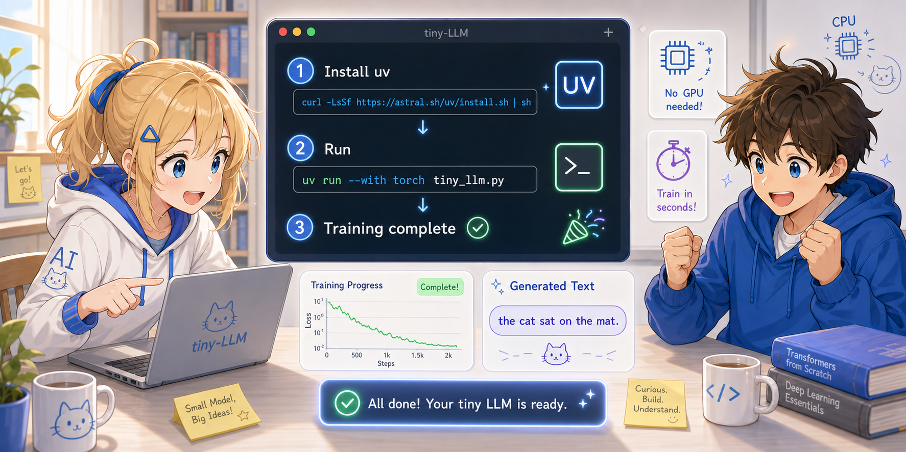

# Step 1: セットアップと実行



まずはコードを動かしてみましょう。

---

## 1.1 必要なもの

このプロジェクトを動かすのに必要なのは **[uv](https://docs.astral.sh/uv/)** だけです。
Python 本体も PyTorch も、uv が必要に応じて自動で揃えてくれます。
GPU は不要、tiny-LLM は数秒で訓練が完了します。

uv のインストール:

```bash
# macOS / Linux
curl -LsSf https://astral.sh/uv/install.sh | sh

# Windows (PowerShell)
powershell -c "irm https://astral.sh/uv/install.ps1 | iex"

# Homebrew (macOS)
brew install uv
```

インストール後、`uv --version` でバージョンが表示されれば OK です。

> **uv を使う理由**: pip + venv より高速で、Python のバージョン管理から
> 依存パッケージのインストールまで 1 ツールで完結します。
> 仮想環境を手動で作る必要も、`source venv/bin/activate` も要りません。

---

## 1.2 コードの取得

```bash
git clone https://github.com/t-ishii66/tiny-llm.git
cd tiny-llm
```

主な実装ファイルはこの2つです：

```
tiny-llm/
├── tiny_llm.py              ← 全実装（実コード約140行）
├── tiny_llm_instruct.py     ← 第5章で使う instruction tuning 用
├── docs/
│   ├── ja/                  ← 日本語ドキュメント
│   │   ├── 01_data.md
│   │   ├── 02_transformer.md
│   │   ├── 03_training.md
│   │   ├── 03a_gradient.md
│   │   ├── 04_generation.md
│   │   ├── 05_instruction_tuning.md
│   │   └── tutorial/        ← このチュートリアル
│   └── en/                  ← English documentation
│       └── ...
└── README.md
```

---

## 1.3 実行する

```bash
uv run --with torch tiny_llm.py
```

`--with torch` は「PyTorch を一時的に追加して、このスクリプトを走らせて」という指定です。
初回は PyTorch のダウンロードが入るので少し待ちますが、2 回目以降はキャッシュから瞬時に起動します。
Python が入っていない環境でも、uv が必要なバージョンを自動で取ってきます。

> 第5章の `tiny_llm_instruct.py` も同じ要領で実行できます: `uv run --with torch tiny_llm_instruct.py`

以下のような出力が表示されます（数値は実行のたびに多少変わります）：

```
vocab size: 10
vocab: {'<pad>': 0, 'the': 1, 'cat': 2, 'sat': 3, 'on': 4, 'mat': 5, '.': 6, 'dog': 7, 'log': 8, 'saw': 9}

training samples: 28, seq_len: 12

epoch   20  loss=1.9469
epoch   40  loss=1.5257
epoch   60  loss=0.8140
epoch   80  loss=0.5469
epoch  100  loss=0.3880
epoch  120  loss=0.3099
epoch  140  loss=0.2568
epoch  160  loss=0.2227
epoch  180  loss=0.1862
epoch  200  loss=0.1147

--- Generation ---
prompt: "the cat sat on"
output: the cat sat on the mat . the dog sat on the log . the cat saw the dog . the dog saw the

prompt: "the dog saw"
output: the dog saw the cat . the cat sat on the log . the dog sat on the mat . the dog sat
```

---

## 1.4 出力の読み方

### 訓練の経過

```
epoch   20  loss=1.9469    ← まだでたらめな予測
epoch  200  loss=0.1147    ← ほぼ完璧な予測
```

- **epoch**: 訓練データを何周したか
- **loss**: 予測の悪さ（小さいほど良い）。ランダムなら約 2.3、完璧なら 0

### 生成結果

```
prompt: "the cat sat on"
output: the cat sat on the mat . the dog sat on the log ...
```

- **prompt**: モデルに与えた入力テキスト
- **output**: モデルが1単語ずつ予測して生成したテキスト

訓練コーパスに沿った自然な英文が生成されています。

> **注意**: `generate()` に渡す prompt は、学習コーパスに含まれる単語だけで作ってください。
> コーパス外の単語（語彙外トークン）を含むと、現実装では例外になります。

---

## 1.5 何が起きたのか

たった数秒で、以下が実行されました：

1. **データ準備**: 40単語のコーパスを数値に変換し、訓練データを作成
2. **モデル構築**: 約68,000パラメータの Transformer を初期化
3. **訓練**: 200回の学習ループで「次の単語の予測」を学習
4. **生成**: 学習済みモデルでテキストを生成

次のステップでは、この各段階の中身を自分の目で確認していきます。

---

## (補足) uv が PyTorch をどこに入れるか

気になる人だけ読めば OK。`uv run --with torch ...` で入れた PyTorch は、すべて **uv 専用のキャッシュディレクトリ** に置かれます。プロジェクトディレクトリ (`./.venv/` 等) にも、システム Python にも、Homebrew Python にも何も書き込みません。

| OS | キャッシュ場所 |
|---|---|
| macOS | `~/Library/Caches/uv/` |
| Linux | `~/.cache/uv/` |
| Windows | `%LocalAppData%\uv\cache\` |

- 場所の確認: `uv cache dir`
- 容量を抑える: `uv cache prune` (古いものだけ削除)
- 完全リセット: `uv cache clean`

---

次へ: [Step 2: データを観察する](02_explore_data.md)
